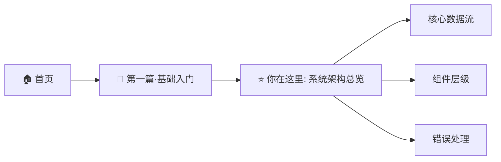

# 系统架构总览（源码增强版）

> **所属位置:** 🚀 第一篇·基础入门 → 系统架构总览  
> **上一步:** 首页 [index.md](../index.md)  
> **下一步:** [核心数据流](02-data-flow.md) — 用户请求是怎么走完 5 条路径的

---



---

> **覆盖范围:** Electron 桌面壳 (main.cjs) + 代理层 TypeScript (10 模块, 3031 行) + 后端 Go
> **核心发现:** 四层架构、4 种客户端访问模式、代理启动 7 步、Electron 壳薄至 138 行

## 1. 四层架构

```
┌──────────────────────────────────────────────────────────────────────────┐
│  第一层：展现层 (Presentation)                                             │
│  ┌──────────────┐  ┌──────────────┐  ┌──────────────┐  ┌─────────────┐  │
│  │ Electron     │  │ Web 前端     │  │ OpenAI SDK   │  │ curl/CLI    │  │
│  │ 桌面壳 (138L)│  │ (Vue SPA)   │  │ (Codex)      │  │             │  │
│  └──────┬───────┘  └──────┬───────┘  └──────┬───────┘  └──────┬──────┘  │
└─────────┼─────────────────┼─────────────────┼──────────────────┼─────────┘
          │  HTTPS/WS (443)│  HTTPS/WS (443)  │  HTTP/SSE (9090) │ HTTP/SSE
┌─────────▼─────────────────▼─────────────────▼──────────────────▼─────────┐
│  第二层：代理网关 (Reverse Proxy)                                           │
│  TypeScript 10 模块, 3031 行, port 9090                                  │
│  ┌────────────────────────────────────────────────────────────────────┐  │
│  │ server.ts(331) → api-routes.ts(545)                               │  │
│  │   ├── task-runner.ts(464) → auth.ts(238) → monkeycode-ai.com      │  │
│  │   ├── account-pool.ts(299) → auth.ts                              │  │
│  │   ├── models.ts(102) → auth.ts                                    │  │
│  │   └── conversation-manager.ts(369) → auth.ts                      │  │
│  │ admin-login.ts(416) → browser-headers.ts(87)                      │  │
│  │ types.ts(180)（纯类型, 零依赖）                                     │  │
│  └────────────────────────────────────────────────────────────────────┘  │
└──────────────────────────┬───────────────────────────────────────────────┘
                           │ HTTPS/WS (443)
┌──────────────────────────▼───────────────────────────────────────────────┐
│  第三层：MonkeyCode 后端 (Go)                                              │
│  ┌──────────┐ ┌──────────┐ ┌──────────┐ ┌──────────┐ ┌──────────────┐  │
│  │ Gin API  │ │ UseCase  │ │ Ent ORM  │ │ LLM      │ │ TaskFlow     │  │
│  │ 中间件    │ │ 业务逻辑  │ │ PgSQL/   │ │ Client   │ │ Client       │  │
│  │          │ │          │ │ Redis    │ │ (3 SDK)  │ │ (HTTP+WS)    │  │
│  └──────────┘ └──────────┘ └──────────┘ └──────────┘ └──────────────┘  │
└──────────────────────┬───────────────────────────────────────────────────┘
                       │ HTTP / gRPC
┌──────────────────────▼───────────────────────────────────────────────────┐
│  第四层：基础设施                                                          │
│  ┌────────────┐ ┌──────────────┐ ┌────────────┐ ┌────────────────────┐  │
│  │ TaskFlow   │ │ Docker       │ │ LLM        │ │ 存储: Redis +      │  │
│  │ VM 调度器   │ │ 容器 Agent  │ │ Provider   │ │ PostgreSQL        │  │
│  │ (闭源)     │ │ (Node.js)    │ │ (11 个)    │ │                    │  │
│  └────────────┘ └──────────────┘ └────────────┘ └────────────────────┘  │
└──────────────────────────────────────────────────────────────────────────┘
```

## 2. 展现层：Electron 桌面壳源码分析

```javascript
// analysis/asar-content/electron/main.cjs — 138 行完整代码
// 核心发现：极薄浏览器壳，仅为 Web 应用提供桌面窗口

// 生产模式：加载 MonkeyCode 线上 URL
const DEFAULT_PROD_URL = "https://monkeycode-ai.com"
const START_PATH = process.env.MONKEYCODE_DESKTOP_START_PATH || "/console/"

function createWindow() {
  const win = new BrowserWindow({
    width: 1280, height: 800,
    minWidth: 900, minHeight: 640,
    webPreferences: {
      preload: path.join(__dirname, "preload.cjs"),
      contextIsolation: true,     // ✅ 安全：隔离渲染进程
      nodeIntegration: false,     // ✅ 安全：禁止 Node.js API
      sandbox: false,             // ⚠️ 非沙箱
    },
  })

  // 加载模式
  if (isDev) {
    win.loadURL(desktopEntryUrl(process.env.VITE_DEV_SERVER_URL || "http://localhost:11180"))
  } else {
    win.loadURL(desktopEntryUrl(process.env.MONKEYCODE_DESKTOP_URL || DEFAULT_PROD_URL))
  }
}
```

| 启动模式 | 条件 | 加载地址 |
|---------|------|---------|
| 开发模式 | `!app.isPackaged` | `http://localhost:11180/console/` |
| 本地构建 | `MONKEYCODE_LOAD_LOCAL_DIST=1` | `file://...web-dist/index.html` |
| 生产在线 | 默认 | `https://monkeycode-ai.com/console/` |
| 自定义 | `MONKEYCODE_DESKTOP_URL` | 自定义地址 |

### Electron 壳关键功能：

| 功能 | 代码 | 说明 |
|------|------|------|
| 单实例锁 | `app.requestSingleInstanceLock()` | 只允许一个实例 |
| 启动超时保护 | `ensureWindowVisible(win, 2000)` | 2 秒后强制显示窗口 |
| 加载失败弹窗 | `dialog.showErrorBox()` | 显示错误信息 |
| 外链拦截 | `setWindowOpenHandler` | 外部链接系统浏览器打开 |
| 非 macOS 隐藏菜单 | `Menu.setApplicationMenu(null)` | 去掉顶部菜单栏 |

## 3. 四种客户端访问模式

```
Electron 桌面壳 ───→ HTTPS 443 ───→ MonkeyCode 后端（直接）
Web 浏览器     ───→ HTTPS 443 ───→ MonkeyCode 后端（直接）
OpenAI SDK     ───→ HTTP 9090 ───→ 代理层 ──→ HTTPS 443 ──→ 后端
curl/CLI       ───→ HTTP 9090 ───→ 代理层 ──→ HTTPS 443 ──→ 后端
```

| 特性 | 直接客户端 | 代理客户端 |
|------|-----------|-----------|
| 认证方式 | Cookie | API Key（伪）|
| 端口 | 443 | 9090 |
| 协议 | HTTPS + WebSocket | HTTP + SSE |
| 模型访问 | 所有模型（受订阅限制） | 代理缓存列表 |

## 4. 代理层启动序列（7 步）

```
Step 1: 解析环境变量
   PORT=9090, MONKEYCODE_BASE_URL=https://monkeycode-ai.com, ACCOUNT_POOL_FILE

Step 2: 初始化号池/单账号
   ├── ACCOUNT_POOL_FILE → 加载多账号 JSON
   ├── MONKEYCODE_EMAIL+PASSWORD → 添加单账号
   └── new AccountPool() → initAll() → startHealthCheck()

Step 3: 创建核心模块
   ├── new ModelManager(auth)
   └── new TaskRunner(auth)

Step 4: 首次认证 + 模型获取
   ├── auth.getSessionCookie()（单账号模式）
   └── modelManager.fetchModels()

Step 5: 配置中间件链
   ├── cors() — 允许跨域
   └── express.json({ limit: "10mb" })

Step 6: 注册 OpenAI 兼容 + 管理端点（共 12 个）

Step 7: 监听端口
   ├── http://localhost:9090/v1/models
   ├── http://localhost:9090/v1/chat/completions
   └── http://localhost:9090/admin/...
```

## 5. 代理层 10 模块职责

| 模块 | 行数 | 依赖 | 核心职责 |
|------|------|------|---------|
| `server.ts` | 331 | 7 个模块 | 入口、初始化、启动 |
| `api-routes.ts` | 545 | 5 个模块 | OpenAI 兼容路由 |
| `task-runner.ts` | 464 | 3 模块 + ws | 任务创建 + WS 流 |
| `conversation-manager.ts` | 369 | 3 模块 + ws | 多轮对话 |
| `admin-login.ts` | 416 | 1 模块 | OAuth HTTP 自动化 |
| `account-pool.ts` | 299 | 1 模块 | 多账号管理 |
| `auth.ts` | 238 | 0 模块 | Session 管理 |
| `models.ts` | 102 | 2 模块 | 模型缓存与解析 |
| `types.ts` | 180 | 0 模块 | 类型定义 |
| `browser-headers.ts` | 87 | 0 模块 | 请求头生成 |

## 6. 核心设计模式

| 模式 | 位置 | 说明 |
|------|------|------|
| **分层架构** | 系统整体 | 展现/代理/后端/基础设施分离 |
| **反向代理** | 代理层 | 协议转换 + 认证注入 + 缓存 |
| **依赖注入** | `api-routes.ts` | 运行时传入 AuthManager 等 |
| **状态机** | `account-pool.ts` | CREATED→ACTIVE→EXPIRED→INVALID |
| **观察者（事件流）** | `task-runner.ts` | ACP 事件 → SSE/SSE 转换 |
| **适配器** | `api-routes.ts` | ACP → OpenAI Chat/Responses |
| **门面** | `api-routes.ts` | 统一接口（Chat + Responses + Models）|

---

## 相关章节

- [核心数据流](02-data-flow.md) — 完整请求生命周期
- [组件层级分析](03-component-layer.md) — 各组件职责与类型
- [错误处理模式](04-error-handling-patterns.md) — 5 种错误处理
- [代理架构概览](../07-proxy/01-architecture.md) — 模块间调用关系
- [server.ts 启动分析](../07-proxy/08-server-startup.md) — 7 步启动详情
