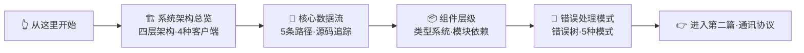

# 第一篇：基础入门

> **所属位置:** 本书起点 — 理解 MonkeyCode 是什么、怎么构成的
> **阅读目标:** 掌握系统架构全貌，为后续协议和实现分析打下基础
> **前置要求:** 无
> **预计时间:** 15 分钟

---

本篇是整本书的起点。读完本篇后，你会对 MonkeyCode 平台有一个完整的架构认知。

## 文件清单

| # | 文件 | 内容 | 行数 |
|---|------|------|------|
| 1 | [系统架构总览](01-system-overview.md) | 四层架构、Electron 壳、4 种客户端、代理 7 步启动 | 187L |
| 2 | [核心数据流](02-data-flow.md) | 5 条核心数据路径：Chat/Responses/OAuth/账户/模型 | 283L |
| 3 | [组件层级分析](03-component-layer.md) | types.ts 类型系统、模块依赖图、跨层类型流 | 716L |
| 4 | [错误处理模式](04-error-handling-patterns.md) | 错误处理树、5 种模式、源码级错误码 | 409L |

## 核心源码速查

| 层 | 位置 | 语言 | 行数 |
|----|------|------|------|
| 客户端 | `analysis/asar-content/electron/main.cjs` | JS | ~200 |
| 代理层 | `proxy/src/`（10 文件） | TypeScript | ~3,031 |
| 后端 | `chaitin/MonkeyCode/backend/` | Go | — |

---

**继续阅读:** [第二篇·通讯协议 → 认证协议](../02-auth/README.md)