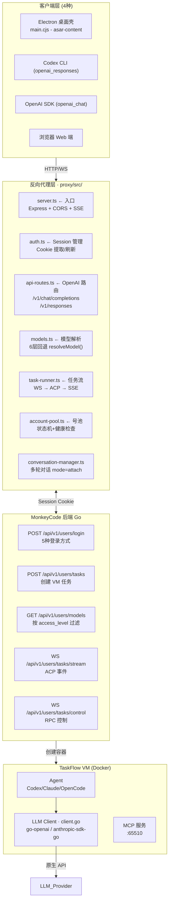

# 第一章：系统架构

> **章节状态:** ✅ 所有文件已完成
> **最后更新:** 2026-06-25
> **覆盖范围:** MonkeyCode 整体系统架构、数据流、组件层级、错误处理模式

---

## 文件清单

| # | 文件 | 内容 | 完成度 |
|---|------|------|--------|
| 1 | [01-system-overview.md](01-system-overview.md) | 系统架构总览（三层架构、组件关系） | ✅ 已完成 |
| 2 | [02-data-flow.md](02-data-flow.md) | 核心数据流（任务创建→执行→返回） | ✅ 已完成 |
| 3 | [03-component-layer.md](03-component-layer.md) | 组件层级分析（前端、后端、TaskFlow、VM） | ✅ 已完成 |
| 4 | [04-error-handling-patterns.md](04-error-handling-patterns.md) | 错误处理模式（LLM 错误、WS 重连、模拟模式） | ✅ 已完成 |

---

## 系统架构

## 源码速查

| 层次 | 源码位置 | 语言 | 行数 |
|------|---------|------|------|
| 客户端 | `analysis/asar-content/electron/main.cjs` | JavaScript | ~200 |
| 代理层 | `proxy/src/` (10 文件) | TypeScript | ~3,031 |
| 后端 | `chaitin/MonkeyCode/backend/` | Go | 闭源分析 |
| VM | `chaitin/MonkeyCode/backend/pkg/taskflow/vm.go` | Go | ~500 |

---

## 相关章节

- [第二章：认证协议](../02-auth/README.md) — 本架构中的认证组件
- [第六章：VM & TaskFlow](../06-vm-taskflow/README.md) — TaskFlow 服务和 VM 生命周期细节