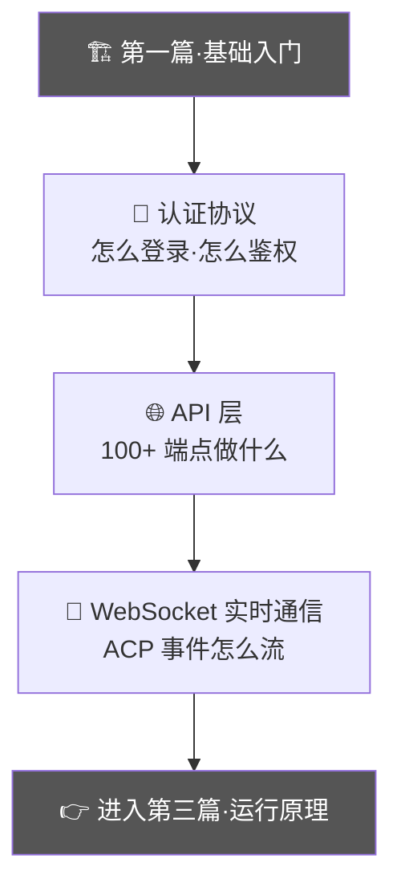

# 第二篇：通讯协议

> **所属位置:** 本书第二篇 — 理解 MonkeyCode 前后端之间怎么通信
> **阅读目标:** 掌握认证、API、WebSocket 三大通讯环节的完整协议
> **前置要求:** 先读第一篇·基础入门
> **预计时间:** 40 分钟

---

通讯协议篇分为三个子主题，建议按顺序阅读：

1. **认证协议** — 从 Session 到 OAuth，完整的身份认证体系
2. **API 层** — 100+ 端点的功能目录和授权模型
3. **WebSocket 实时通信** — ACP 事件如何从 VM 流到前端

---

## 子主题一：认证协议

| # | 文件 | 内容 | 行数 |
|---|------|------|------|
| 1 | [Session 存储机制](01-session-storage.md) | Redis 双结构、Cookie TTL、30 天过期 | 306L |
| 2 | [验证码系统](02-captcha-system.md) | CAP.js、go-cap 50x32 网格验证码 | 205L |
| 3 | [五种登录方式](03-login-methods.md) | 密码/OAuth/Git/团队/Impersonate | 208L |
| 4 | [百智云 OAuth](04-oauth-baizhi-cloud.md) | 6 步 OAuth 流程、SCaptcha + SMS | 275L |
| 5 | [认证中间件](05-auth-middleware.md) | Go 中间件 + AuthManager 双视角 | 282L |
| 6 | [密码管理](06-password-management.md) | bcrypt 实现、修改/重置流程 | 157L |
| 7 | [认证自动化](07-auth-automation.md) | 验证码绕过、Session 保活 | 247L |
| 8 | [号池缺口分析](08-pool-gap-analysis.md) | 多账号策略、状态机、锁机制 | 397L |

---

## 子主题二：API 层

| # | 文件 | 内容 | 行数 |
|---|------|------|------|
| 1 | [端点目录](../05-api/01-endpoint-catalog.md) | 100+ 端点完整清单 | 249L |
| 2 | [授权矩阵](../05-api/02-authorization-matrix.md) | 角色/中间件/资源三层授权 | 394L |
| 3 | [Conversation API](../05-api/03-conversation-api.md) | 多轮会话 API 设计 | 222L |
| 4 | [订阅与计费](../05-api/04-subscription-billing.md) | SubscriptionResp、余额查询 | 216L |
| 5 | [Admin 管理 API](../05-api/05-admin-management-api.md) | 用户/模型/审计管理员端点 | 299L |

---

## 子主题三：WebSocket 实时通信

| # | 文件 | 内容 | 行数 |
|---|------|------|------|
| 1 | [Task Stream](../04-websocket/01-task-stream.md) | ACP 事件流、用户输入、重连机制 | 279L |
| 2 | [Task Control](../04-websocket/02-task-control.md) | RPC 调用：文件操作、重启、切换模型 | 237L |
| 3 | [Terminal TTY](../04-websocket/03-terminal.md) | 交互式终端、二进制帧 | 290L |
| 4 | [TaskLive 内部](../04-websocket/04-tasklive-internal.md) | Backend ↔ TaskFlow 内部通信 | 212L |
| 5 | [语音转文本](../04-websocket/05-speech-to-text.md) | Doubao ASR、PCM S16LE 编码 | 259L |
| 6 | [ACP 事件参考](../04-websocket/06-acp-event-reference.md) | 完整事件类型和字段 | 201L |
| 7 | [会话生命周期](../04-websocket/07-conversation-lifecycle.md) | mode=attach 多轮复用 | 465L |

---

**继续阅读:** [第三篇·运行原理 → LLM 调用链路](../03-llm/README.md)