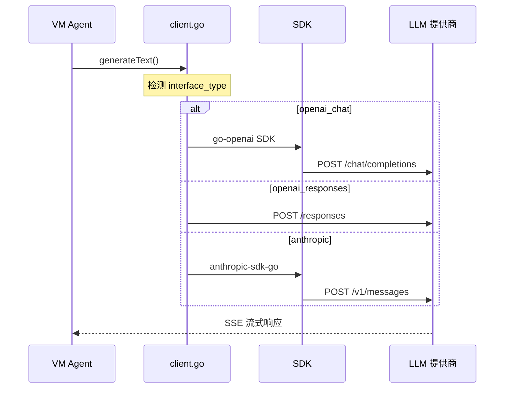

# 第三篇：运行原理

> **所属位置:** 本书第三篇 — 理解 AI 能力怎么被调用和执行
> **阅读目标:** 掌握 LLM 调用链路和 VM 执行引擎的完整流程
> **前置要求:** 先读第二篇·通讯协议
> **预计时间:** 30 分钟

---

## LLM 调用链路

| # | 文件 | 内容 | 行数 |
|---|------|------|------|
| 1 | [模型管理 API](01-model-management-api.md) | CRUD、Owner 权限、6 层解析 | 293L |
| 2 | [三种接口类型](02-interface-types.md) | openai_chat / openai_responses / anthropic | 305L |
| 3 | [提供商配置](03-provider-list.md) | 11 个提供商、Base URL、默认模型 | 223L |
| 4 | [模型定价与配额](04-model-pricing-quota.md) | 3 级订阅、访问级别、并发控制 | 202L |
| 5 | [LLM 集成协议](05-llm-integration.md) | Client 架构、SDK 选择、错误处理 | 298L |
| 6 | [Coding Agent 配置](06-coding-agent-config.md) | 4 种 cli_name、NPM 包、容器注入 | 163L |
| 7 | [私有模型创建](06-private-model-creation.md) | 私有/团队/公开三级 Owner | 317L |
| 8 | [模型发现 Pipeline](07-model-discovery-pipeline.md) | 6 层回退解析、5 分钟缓存 | 413L |

## VM & TaskFlow 执行引擎

| # | 文件 | 内容 | 行数 |
|---|------|------|------|
| 1 | [TaskFlow 架构](../06-vm-taskflow/01-architecture.md) | 后端↔Docker 中间调度层 | 164L |
| 2 | [VM 生命周期](../06-vm-taskflow/02-vm-lifecycle.md) | 7 种状态、启动链、空闲回收 | 246L |
| 3 | [MCP 协议](../06-vm-taskflow/03-mcp-protocol.md) | JSON-RPC 2.0、内置 + 外部工具 | 367L |
| 4 | [Agent 内部架构](../06-vm-taskflow/04-agent-internals.md) | Codex/Claude/OpenCode NPM 包 | 277L |
| 5 | [资源管理](../06-vm-taskflow/05-resource-management.md) | CPU/Memory、空闲休眠、回收策略 | 231L |

---

**继续阅读:** [第四篇·工程实现 → 反向代理](../07-proxy/README.md)