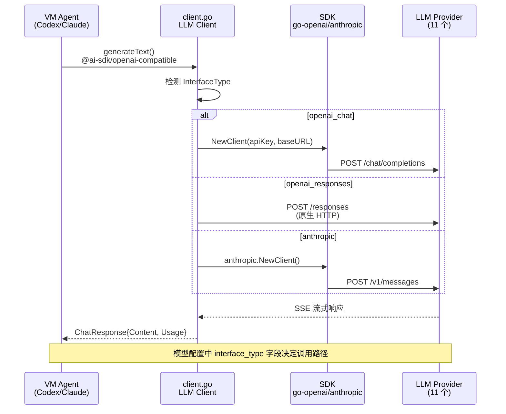
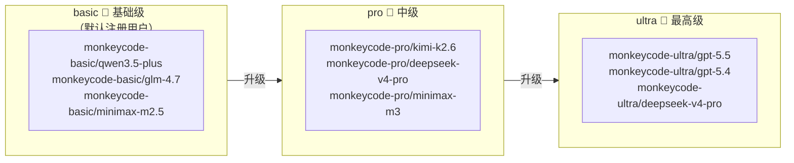

# 第三章：LLM 通信协议

> **章节状态:** ✅ 所有文件已创建
> **最后更新:** 2026-06-25
> **覆盖范围:** 模型管理 API、3 种 LLM 接口类型、11 个模型提供商、模型定价与配额

---

## 文件清单

| # | 文件 | 内容 | 完成度 |
|---|------|------|--------|
| 1 | [01-model-management-api.md](01-model-management-api.md) | 模型管理 API（CRUD + 健康检查 + 分页） | ✅ 已完成 |
| 2 | [02-interface-types.md](02-interface-types.md) | 3 种接口类型详解（openai_chat / openai_responses / anthropic） | ✅ 已完成 |
| 3 | [03-provider-list.md](03-provider-list.md) | 11 个模型提供商配置（Base URL、默认模型、SDK） | ✅ 已完成 |
| 4 | [04-model-pricing-quota.md](04-model-pricing-quota.md) | 模型定价与配额分析（3 级订阅、访问级别、配额推测） | ✅ 已完成 |
| 5 | [05-llm-integration.md](05-llm-integration.md) | LLM 集成协议详解（Client 架构、接口自动检测） | ✅ 已完成 |
| 6 | [06-coding-agent-config.md](06-coding-agent-config.md) | Coding Agent 配置生成（NPM 包选择、LLM 配置注入） | ✅ 已完成 |
| 7 | **[07-model-discovery-pipeline.md](07-model-discovery-pipeline.md)** | **新增** 模型发现 Pipeline 全景（6 层回退解析、5 分钟缓存） | ✅ **新维度** |

---

## LLM 调用链

## 三级访问控制

| 关键项 | 值 |
|--------|-----|
| LLM 调用位置 | TaskFlow VM 内部（非 Backend 进程内） |
| 接口类型 | openai_chat / openai_responses / anthropic |
| 提供商数量 | 11 个（OpenAI、Anthropic、DeepSeek、SiliconFlow 等） |
| 订阅等级 | basic / pro / ultra |
| 模型权限 | public（公开）/ team（团队）/ private（私有） |

---

## 相关章节

- [第四章：WebSocket 协议](../04-websocket/README.md) — LLM 输出的流式传输
- [第六章：VM & TaskFlow](../06-vm-taskflow/README.md) — LLM Client 在 VM 中的运行环境
- [第七章：代理实现](../07-proxy/README.md) — 代理中的模型管理和事件映射