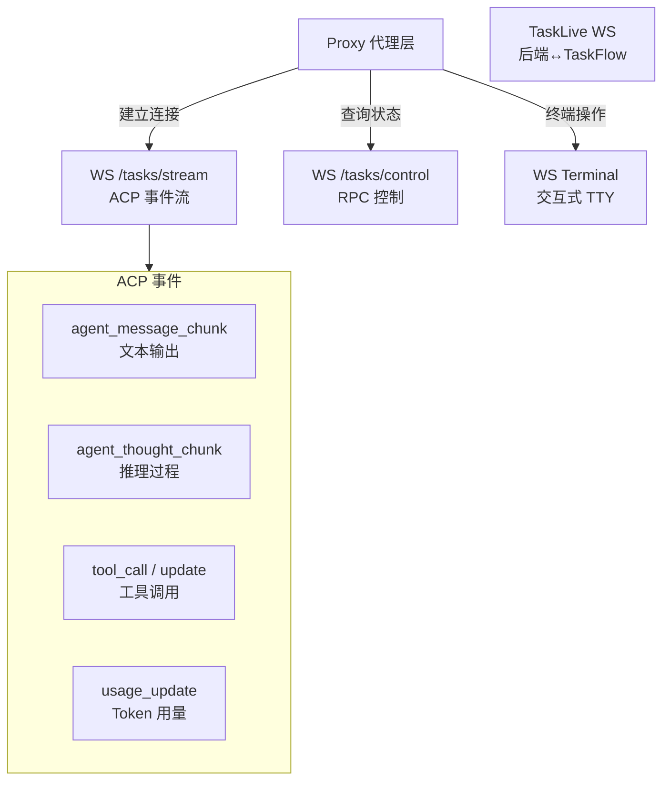

# WebSocket 实时通信

> **所属位置:** 第二篇·通讯协议 — WebSocket 通道协议
> **前置要求:** 先读认证协议和 API 层
> **阅读目标:** 掌握 ACP 事件如何从 VM 流到前端

| # | 文件 | 内容 | 行数 |
|---|------|------|------|
| 1 | [Task Stream](01-task-stream.md) | ACP 事件流、用户输入、重连机制 | 279L |
| 2 | [Task Control](02-task-control.md) | RPC 调用：文件操作、重启、切换模型 | 237L |
| 3 | [Terminal TTY](03-terminal.md) | 交互式终端、二进制帧、Keepalive | 290L |
| 4 | [TaskLive 内部通信](04-tasklive-internal.md) | Backend ↔ TaskFlow 节点通信 | 212L |
| 5 | [语音转文本](05-speech-to-text.md) | Doubao ASR、PCM S16LE 编码 | 259L |
| 6 | [ACP 事件参考](06-acp-event-reference.md) | 完整事件类型、字段、示例 | 201L |
| 7 | [会话生命周期](07-conversation-lifecycle.md) | mode=attach 多轮复用协议 | 465L |