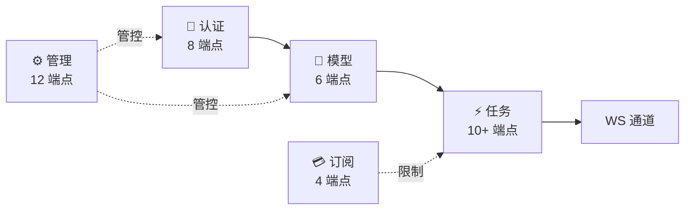

# API 层

> **所属位置:** 第二篇·通讯协议 — REST API 层
> **前置要求:** 先读认证协议
> **阅读目标:** 掌握 100+ 端点的功能、授权模型和使用方式

| # | 文件 | 内容 | 行数 |
|---|------|------|------|
| 1 | [端点目录](01-endpoint-catalog.md) | 100+ 端点完整清单 | 249L |
| 2 | [授权矩阵](02-authorization-matrix.md) | 角色体系、5 种中间件、资源规则 | 394L |
| 3 | [Conversation API](03-conversation-api.md) | 多轮会话 6 端点、JSON Schema | 222L |
| 4 | [订阅与计费](04-subscription-billing.md) | SubscriptionResp、余额、Stripe | 216L |
| 5 | [Admin 管理 API](05-admin-management-api.md) | 用户/模型/审计 12 端点 | 299L |