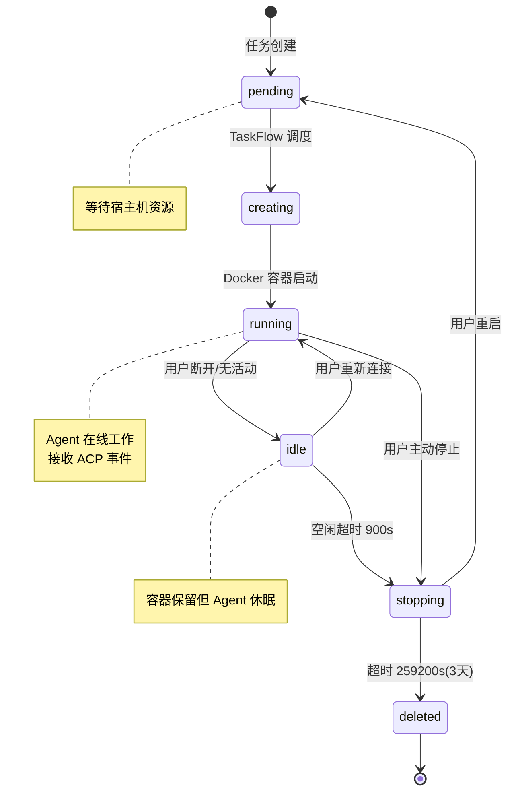
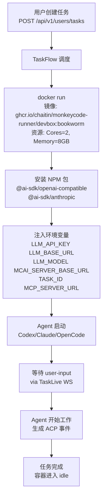

# 第六章：VM & TaskFlow

> **章节状态:** ✅ 所有文件已创建（MCP、Agent 需线上测试确认等级）
> **最后更新:** 2026-06-25
> **覆盖范围:** TaskFlow 架构定位、VM 生命周期、MCP 协议、Agent 内部架构、资源管理

---

## 文件清单

| # | 文件 | 内容 | 完成度 |
|---|------|------|--------|
| 1 | [01-architecture.md](01-architecture.md) | TaskFlow 架构定位（后端与 Docker 容器的中间调度层） | ✅ 已完成 |
| 2 | [02-vm-lifecycle.md](02-vm-lifecycle.md) | VM 生命周期（7 种状态、启动链、空闲策略、超时） | ✅ 已完成 |
| 3 | [03-mcp-protocol.md](03-mcp-protocol.md) | MCP 协议分析（内置 mcaiBuiltin + 可选 monkeycode-ai） | 🟡 待线上确认 |
| 4 | [04-agent-internals.md](04-agent-internals.md) | VM 内部 Agent 分析（Codex/Claude/OpenCode NPM 包、启动参数） | 🟡 待线上确认 |
| 5 | [05-resource-management.md](05-resource-management.md) | 资源管理与配额（CPU/Memory/Life、空闲休眠、回收策略） | ✅ 已完成 |

---

## VM 生命周期

## Agent 容器启动链

| 关键项 | 值 |
|--------|-----|
| TaskFlow 状态 | 闭源独立服务 |
| VM 定义 | Docker 容器 |
| 启动链 | 用户→后端→TaskFlow→Host Agent→docker run |
| 空闲回收 | 900s 休眠 → 259200s（3天）回收 |
| Agent 工具 | bash 执行 / 文件读写 / git / MCP 协议 |
| Agent 类型 | Codex / Claude / OpenCode（基于 InterfaceType 选择） |

---

## 相关章节

- [第一章：系统架构](../01-architecture/README.md) — TaskFlow 在整体架构中的位置
- [第三章：LLM 通信协议](../03-llm/README.md) — Agent 调用的 LLM Provider