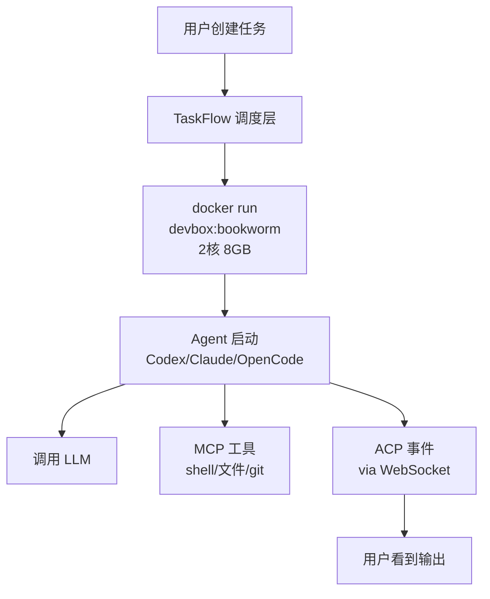

# VM & TaskFlow 执行引擎

> **所属位置:** 第三篇·运行原理 — AI 代码在哪跑
> **前置要求:** 先读 LLM 调用链路
> **阅读目标:** 掌握 Docker 容器如何执行 AI Agent 任务

| # | 文件 | 内容 | 行数 |
|---|------|------|------|
| 1 | [TaskFlow 架构](01-architecture.md) | 后端↔Docker 中间调度层 | 164L |
| 2 | [VM 生命周期](02-vm-lifecycle.md) | 7 种状态、启动链、空闲回收 | 246L |
| 3 | [MCP 协议](03-mcp-protocol.md) | JSON-RPC 2.0、内置/外部工具 | 367L |
| 4 | [Agent 内部架构](04-agent-internals.md) | NPM 包、20+ 环境变量注入 | 277L |
| 5 | [资源管理](05-resource-management.md) | CPU/Memory、空闲 900s 回收 | 231L |