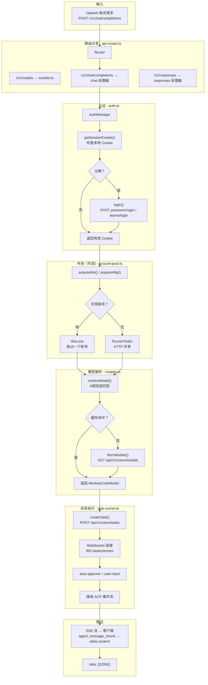

# 第七章：代理实现

> **章节状态:** ✅ 所有文件已创建（新增 2 维度）
> **最后更新:** 2026-06-28
> **覆盖范围:** 代理架构设计、账号号池协议、多轮对话、ACP→OpenAI 映射、OAuth 自动化、浏览器指纹伪装、部署基础设施

---

## 文件清单

| # | 文件 | 内容 | 完成度 |
|---|------|------|--------|
| 1 | [01-architecture.md](01-architecture.md) | 代理架构设计（Express 服务器架构、模块划分） | ✅ 已完成 |
| 2 | [02-account-pool.md](02-account-pool.md) | 账号号池协议（4 种状态、LRU+轮询+互斥锁、健康检查） | ✅ 已完成 |
| 3 | [03-multi-turn-conversation.md](03-multi-turn-conversation.md) | 多轮对话设计（方案对比、ConversationManager 设计） | ✅ 已完成 |
| 4 | [04-acp-to-openai-mapping.md](04-acp-to-openai-mapping.md) | ACP → OpenAI 事件映射（Chat Completions + Responses API） | ✅ 已完成 |
| 5 | [05-oauth-automation.md](05-oauth-automation.md) | OAuth 登录自动化（百智云 6 步流程、SCaptcha 处理） | ✅ 已完成 |
| 6 | [06-browser-fingerprinting.md](06-browser-fingerprinting.md) | 浏览器指纹伪装系统（4 域名专用请求头生成器） | ✅ **新增** |
| 7 | [07-deployment-infrastructure.md](07-deployment-infrastructure.md) | 代理部署与中间件基础设施（CORS、SSE、Nginx） | ✅ **新增** |
| 8 | **[09-error-handling-deep.md](09-error-handling-deep.md)** | **新增** 代理错误处理与重试深度分析（5 种错误码、4 级隔离） | ✅ **新维度** |

---

## 代理请求处理流程

| 关键项 | 值 |
|--------|-----|
| 代理语言 | TypeScript（~3031 行）/ Python（验证工具） |
| 核心模块 | auth / models / task-runner / api-routes / account-pool / conversation-manager / 
 browser-headers / admin-login / types |
| 暴露端点 | `/v1/models`、`/v1/chat/completions`、`/v1/responses`、`/admin/*`（管理端点）|
| 端口 | 9090（TypeScript）/ 9091（Python） |

---

## 相关章节

- [第二章：认证协议](../02-auth/README.md) — 代理认证模块引用的认证协议
- [第四章：WebSocket 协议](../04-websocket/README.md) — 代理 WebSocket 连接的底层协议
- [第八章：分析轮次](../08-analysis-rounds/README.md) — 代理开发和修复的历史过程