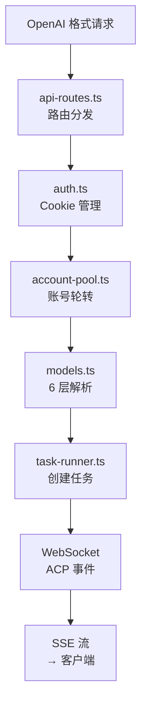

# 反向代理

> **所属位置:** 第四篇·工程实现 — OpenAI 兼容代理的完整实现
> **前置要求:** 先读通讯协议篇和运行原理篇
> **阅读目标:** 理解 TypeScript 代理如何将 MonkeyCode 暴露为标准 API

## 代理请求全流程

## 文件清单

| # | 文件 | 行数 | 说明 |
|---|------|------|------|
| 1 | [代理架构](01-architecture.md) | 277L | 10 模块依赖、5 种设计模式 |
| 2 | [账号池](02-account-pool.md) | 394L | 状态机、双模式获取、健康检查 |
| 3 | [多轮对话](03-multi-turn-conversation.md) | 292L | ConversationManager、mode=attach |
| 4 | [ACP→OpenAI 映射](04-acp-to-openai-mapping.md) | 299L | Chat + Responses 双模式 |
| 5 | [OAuth 自动化(Playwright)](05-oauth-automation.md) | 257L | 6 步 OAuth、Playwright |
| 6 | [浏览器指纹](06-browser-fingerprinting.md) | 248L | 4 域名请求头生成器 |
| 7 | [OAuth HTTP 自动化](06-oauth-automation-http.md) | 294L | 纯 HTTP 6 步协议 |
| 8 | [部署与中间件](07-deployment-infrastructure.md) | 278L | CORS、SSE、Nginx |
| 9 | [服务器启动](08-server-startup.md) | 343L | 7 步启动、12 管理端点 |
| 10 | [错误处理深度](09-error-handling-deep.md) | 441L | 5 种错误码、4 级隔离 |
| 11 | [OAuth HTTP 深度](09-oauth-http-automation-deep.md) | 483L | admin-login.ts 416 行完整分析 |