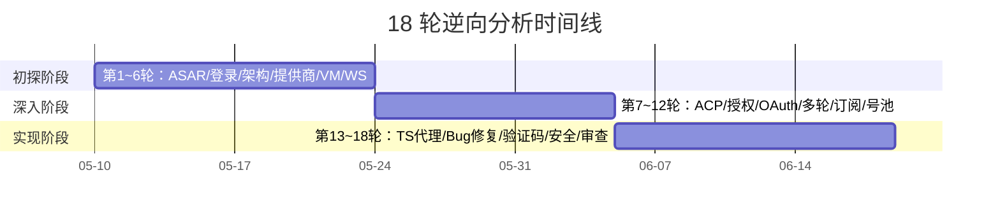

# 逆向分析过程

> **所属位置:** 第五篇·研究记录 — 18 轮逆向分析全记录
> **阅读目标:** 了解每个协议维度的发现过程和决策逻辑

| # | 文件 | 行数 | 覆盖轮次 | 关键发现 |
|---|------|------|---------|---------|
| 1 | [分析过程总结](summary-report.md) | 200+ | 全部 | 时间线、关键发现、产出规模 |
| 2 | [第 1~6 轮（扩增版）](rounds/round-01-to-06.md) | **541** | 1-6 | ASAR/密码登录/三层架构/提供商/VM/WS |
| 3 | [第 7~12 轮（扩增版）](rounds/round-07-to-12.md) | **517** | 7-12 | ACP/授权/OAuth 6步/多轮对话/订阅/号池 |
| 4 | [第 13~18 轮（扩增版）](rounds/round-13-to-18.md) | **380** | 13-18 | ACP→OpenAI/4 Bug修复/TS代理/安全测试 |

## 安全分析

| # | 文件 | 内容 | 行数 |
|---|------|------|------|
| 1 | [百智云安全报告](../09-security/baizhi-security-report.md) | SCaptcha 漏洞（TLS 绕过/重放/短信轰炸） | 268L |
| 2 | [代理安全加固](../09-security/02-proxy-security-analysis.md) | OWASP Top 10 自评、管理端点认证 | 354L |