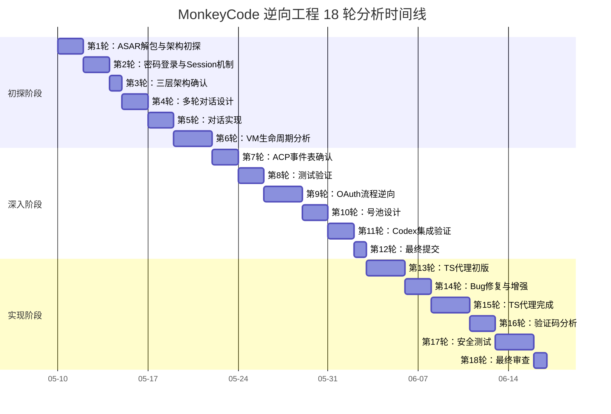

# 第八章：分析轮次

> **章节状态:** ✅ 已完成
> **最后更新:** 2026-06-27
> **覆盖范围:** MonkeyCode 逆向工程 18 轮分析过程的完整记录

---

## 文件清单

| # | 文件 | 内容 | 行数 |
|---|------|------|------|
| 1 | [分析过程总结](summary-report.md) | 18 轮分析的时间线、关键发现、产出规模 | 200+ |
| 2 | [第 1~6 轮（扩增版）](rounds/round-01-to-06.md) | 初探阶段 — ASAR/登录/架构/提供商/VM/WS | **541** |
| 3 | [第 7~12 轮（扩增版）](rounds/round-07-to-12.md) | 深入阶段 — ACP/授权/OAuth/多轮/订阅/号池 | **517** |
| 4 | [第 13~18 轮（扩增版）](rounds/round-13-to-18.md) | 实现阶段 — 代理/Bug修复/TS实现/验证码/安全/审查 | **380** |

> **扩增后合计:** 3 个轮次文件 1,438 行 / 88 代码块（原仅 156 行 / 0 代码块）

---

## 逆向分析时间线

- **第 1 轮** — ASAR 解包发现第一个 API 端点，启动整个逆向项目
- **第 2 轮** — 密码登录 + Session Cookie 机制确认
- **第 6 轮** — TaskFlow VM 生命周期完整分析
- **第 7 轮** — ACP 事件全表确认（7 种 → 最终 9 种）
- **第 9 轮** — 百智云 OAuth 流程逆向
- **第 15 轮** — TypeScript 代理实现完成
- **第 17 轮** — 安全测试发现 3 个漏洞

## 原始分析档案

完整的 18 轮分析原始记录（35 份文件, ~12,903 行）保存在 `docs/protocol/` 目录中，作为历史档案可供查阅。

---

## 相关章节

- [原始分析档案 (docs/protocol/)](../protocol/README.md)
- [文档全书索引](../INDEX.md)
- [分析完成度矩阵](../MASTER-CHECKLIST.md)