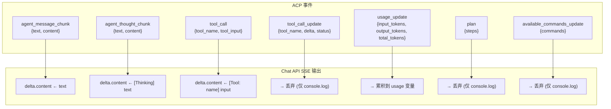
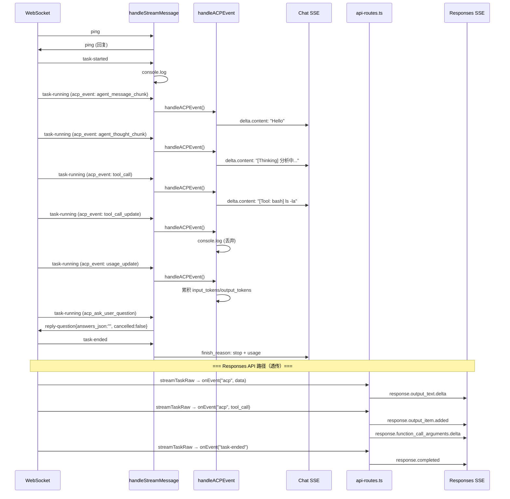

# ACP 事件生成逻辑深度分析

> **所属分类:** P0 缺口 #3 — Agent 对 ACP 事件的生成逻辑
> **关键发现:** ACP 事件处理在两个 API 路径上有完全不同的架构——Chat API 是"拍平"模式，Responses API 是"透传"模式

## 1. 三层消息处理架构

```mermaid
flowchart TB
    subgraph WS_Layer["L1: WebSocket 原始消息层<br/>handleStreamMessage()"]
        WS_RAW["原始 WS 消息<br/>JSON.parse(raw)"]
        WS_PING["type: ping → 回复 ping"]
        WS_TASK_STARTED["type: task-started → console.log"]
        WS_TASK_RUNNING["type: task-running<br/>kind: acp_event"]
        WS_TASK_RUNNING_Q["type: task-running<br/>kind: acp_ask_user_question"]
        WS_TASK_ENDED["type: task-ended → 发 stop chunk"]
        WS_TASK_ERROR["type: task-error → 发 error chunk"]
    end

    subgraph ACP_Layer["L2: ACP 事件层<br/>handleACPEvent()"]
        ACP_MSG["agent_message_chunk<br/>→ delta.content"]
        ACP_THK["agent_thought_chunk<br/>→ [Thinking] + content"]
        ACP_USG["usage_update<br/>→ 累积 token 用量"]
        ACP_TOOL["tool_call<br/>→ [Tool: name] input"]
        ACP_TOOL_U["tool_call_update<br/>→ 仅 console.log"]
        ACP_PLAN["plan → 仅 console.log"]
        ACP_CMD["available_commands_update<br/>→ 仅 console.log"]
    end

    subgraph SSE_Layer["L3: SSE 输出层<br/>Chat API"]
        SSE_CHUNK["data: {...delta.content...}"]
        SSE_DONE["data: [DONE]"]
    end

    subgraph RESP_Layer["L3: SSE 输出层<br/>Responses API (api-routes.ts)"]
        RESP_CREATED["response.created"]
        RESP_ITEM["response.output_item.added"]
        RESP_DELTA["response.output_text.delta"]
        RESP_FUNC_D["response.function_call_arguments.delta"]
        RESP_COMPLETED["response.completed"]
    end

    WS_RAW --> WS_PING
    WS_RAW --> WS_TASK_STARTED
    WS_RAW --> WS_TASK_RUNNING
    WS_TASK_RUNNING --> ACP_MSG
    WS_TASK_RUNNING --> ACP_THK
    WS_TASK_RUNNING --> ACP_USG
    WS_TASK_RUNNING --> ACP_TOOL
    WS_TASK_RUNNING --> ACP_TOOL_U
    WS_TASK_RUNNING --> ACP_PLAN
    WS_TASK_RUNNING --> ACP_CMD
    WS_RAW --> WS_TASK_RUNNING_Q
    WS_RAW --> WS_TASK_ENDED
    WS_RAW --> WS_TASK_ERROR

    ACP_MSG --> SSE_CHUNK
    ACP_THK --> SSE_CHUNK
    ACP_TOOL --> SSE_CHUNK
    WS_TASK_ENDED --> SSE_DONE
    WS_TASK_ERROR --> SSE_CHUNK

    ACP_MSG -.->|streamTaskRaw| RESP_DELTA
    ACP_TOOL -.->|streamTaskRaw| RESP_ITEM
    ACP_TOOL_U -.->|streamTaskRaw| RESP_FUNC_D
```



## 2. 三种消息类型的通路对比

| 消息类型 | Chat API 通路 | Responses API 通路 |
|---------|-------------|-------------------|
| `task-started` | console.log（丢弃） | 转发 `onEvent({type:"task-started"})` |
| `task-running` + `acp_event` | → handleACPEvent() → 7 种事件分支 | → 解析 ACP JSON → `onEvent({type:"acp", data: acp})` |
| `task-running` + `acp_ask_user_question` | 自动回复 `reply-question{answers_json:"", cancelled:false}` | 同上 |
| `task-ended` | → 发 `finish_reason: stop` + `usage` | → `onEvent({type:"task-ended"})` |
| `task-error` | → 发 `delta.content: "[Error] ..."` | → `onEvent({type:"task-error"})` |

## 3. Chat API 的 ACP 事件映射（7 种事件）



## 4. Responses API 的 ACP 事件映射

```typescript
// proxy/src/task-runner.ts:391-400 — streamTaskRaw 透传所有 ACP 事件
// 不做格式转换，直接传给 api-routes.ts 的 onEvent 回调
if (msg.type === "task-running" && msg.kind === "acp_event") {
  const acp: ACPSessionUpdate = JSON.parse(msg.data)
  // 只提取 usage_update 用于累积
  if (acp.type === "usage_update") { ... }
  onEvent({ type: "acp", data: acp })  // 透传
}
```

```typescript
// proxy/src/api-routes.ts:186-261 — Responses API 的 ACP 事件处理
// 在 onEvent 回调中做完整的 ACP→OpenAI Responses 映射

// agent_message_chunk → response.output_text.delta
if (acp.type === "agent_message_chunk" || acp.type === "agent_thought_chunk") {
  sendEvent("response.output_text.delta", { delta: { text: prefix + text } })
}

// tool_call → response.output_item.added (function_call)
sendEvent("response.output_item.added", {
  item: { type: "function_call", id: currentCallId, name: currentToolName, arguments: "" }
})

// tool_call_update → response.function_call_arguments.delta
sendEvent("response.function_call_arguments.delta", { delta: { arguments: updateArgs } })

// tool_call_update (status=completed) → response.function_call_arguments.done
sendEvent("response.function_call_arguments.done", { arguments: finalArgs })
sendEvent("response.output_item.done", { ... })
```

## 5. 关键实现细节

### 5.1 自动审批机制

```typescript
// proxy/src/task-runner.ts:137
ws.send(JSON.stringify({ type: "auto-approve" }))
// 启用自动审批模式，Agent 不再等待用户确认
```

当 Agent 需要用户确认时，发送 `acp_ask_user_question` 事件，代理自动回复空答案：

```typescript
// proxy/src/task-runner.ts:214-230
ws.send(JSON.stringify({
  type: "reply-question",
  data: JSON.stringify({
    request_id: requestId,
    answers_json: "",        // 空答案 = 跳过确认
    cancelled: false,
  }),
}))
```

### 5.2 心跳机制

```typescript
// proxy/src/task-runner.ts:153-156
if (msg.type === "ping") {
  ws.send(JSON.stringify({ type: "ping" }))
  return
}
```

### 5.3 Token 用量累积

```typescript
// proxy/src/task-runner.ts:298-302
case "usage_update":
  if (acp.input_tokens) usage.input_tokens = acp.input_tokens
  if (acp.output_tokens) usage.output_tokens = acp.output_tokens
  if (acp.total_tokens) usage.total_tokens = acp.total_tokens
  break
```

> **注意:** usage_update 是**累计值**（不是增量值），代理直接赋值覆盖。

### 5.4 超时保护

```typescript
// proxy/src/task-runner.ts:180-186
setTimeout(() => {
  if (!resolved) {
    cleanup()
    resolve()
  }
}, TASK_TIMEOUT_MS)  // 默认 1 小时
```

## 6. 完整事件流时序



## 7. 关键发现

| 发现 | 详情 | 影响 |
|------|------|------|
| **Chat API 是"拍平"模式** | 7 种 ACP 事件合并为 3 种 SSE 输出（文本/思考/工具） | 客户端无法区分消息类型 |
| **Responses API 是"透传"模式** | streamTaskRaw 不做任何事件处理，直接将 ACP 原件传给上层 | 上层需要自己处理所有事件 |
| **4 种 ACP 事件被丢弃** | tool_call_update / plan / available_commands_update / task-started 仅 console.log | 客户端看不到工具执行进度、执行计划 |
| **自动审批绕过所有用户确认** | Agent 请求用户确认时自动回复空答案 | 无用户交互的全自动执行 |
| **心跳保持连接** | 10s 级别 ping/pong | 连接稳定 |
| **超时保护是"软"的** | 只 resolve 不关闭远端 VM | 任务继续占用资源 |

## 8. 改进建议

1. **Chat API 应支持 `tool_calls` 字段**，而非将工具调用编码为文本
2. **`tool_call_update` 应转发为 Chat API 的 `delta.tool_calls` 增量更新**
3. **`plan` 事件可映射为 Chat API 的 `delta.content: "[Plan] ..."`**
4. **超时时应同步调用 `stopTask()` 关闭远端 VM**，避免资源泄漏
5. **Responses API 的 currentOutputIndex 管理需要更健壮**，当前在 tool_call_update end 时递增

---

**更新状态:** ✅ 已分析完成
**更新文件:** docs/08-analysis-rounds/unknown-gaps-index.md