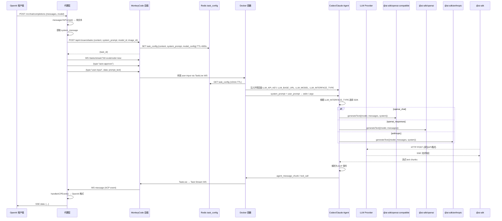
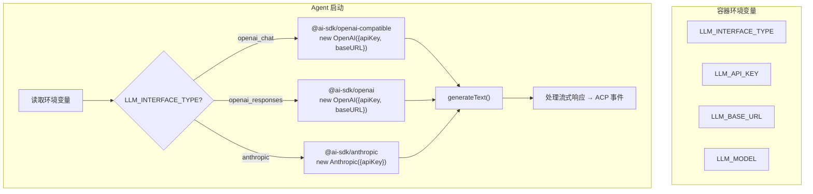
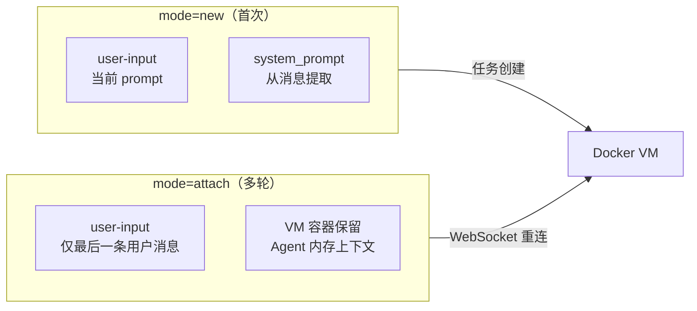

# Agent LLM 请求构建机制分析

> **所属分类:** P0 缺口 #1 — Agent 如何构造 LLM 请求（prompt template）
> **关键发现:** Agent 的 LLM 请求构造是"明文粘贴"模式，没有任何 prompt template 模板工程

## 1. 完整调用链



## 2. messagesToPrompt() — 代理层的 Prompt 构造

```typescript
// proxy/src/api-routes.ts:354-368
function messagesToPrompt(messages: OpenAIMessage[]): string {
  return messages
    .map((m) => {
      switch (m.role) {
        case "user":
          return `[User]\n${m.content}`
        case "assistant":
          return `[Assistant]\n${m.content}`
        default:
          return m.content
      }
    })
    .join("\n\n")
}
```

**关键发现:** 这个转换极其简单——仅将 OpenAI 的 `role/content` 格式转为 `[User]/[Assistant]` 前缀 + 纯文本。没有任何 prompt 模板、格式指令、角色系统提示。

### 转换示例

**输入（OpenAI 格式）:**
```json
[
  {"role": "system", "content": "你是专业的代码审查助手"},
  {"role": "user", "content": "帮我审查这段代码"}
]
```

**输出（MonkeyCode 格式）:**
```
[User]
帮我审查这段代码
```

> 注意：system message 在上游被提取为 `system_prompt` 字段，不经过 messagesToPrompt。

## 3. Task 创建时的完整请求体

```typescript
// proxy/src/task-runner.ts:55-74
const body = {
  content: prompt,                    // messagesToPrompt() 输出
  host_id: "public_host",
  image_id: "2e214f06-...",
  model_id: model.id,                 // 模型 UUID
  cli_name: model.interface_type === "openai_responses" ? "codex"
    : model.interface_type === "anthropic" ? "claude"
    : "opencode",
  resource: { core: 1, memory: 1073741824, life: 3600 },
  repo: { repo_url: "", branch: "master", repo_filename: "", zip_url: "" },
  system_prompt: systemMsg?.content,  // 可选
}
```

## 4. VM 容器内 Agent 的 LLM 调用

### 4.1 环境变量注入

容器启动时注入以下关键环境变量：

```
LLM_API_KEY        = 模型配置中的 api_key（后端注入的真实 Key）
LLM_BASE_URL       = 模型配置中的 base_url（如 api.openai.com）
LLM_MODEL          = 模型配置中的 model（如 gpt-4o）
LLM_INTERFACE_TYPE = openai_chat / openai_responses / anthropic
```

### 4.2 Agent 的 SDK 选择



### 4.3 prompt 传递给 Agent 的方式

Agent 通过以下路径获取用户 prompt：

1. **首次 user-input** — 通过 TaskLive WS 发送（`type: "user-input", data: prompt`）
2. **Redis task_config** — Agent 启动时读取 `GET task_config:{taskId}`（10 分钟 TTL）
3. **system_prompt** — 作为独立字段存储，Agent 在构造 LLM 请求时前置

Agent 收到这些信息后，构造出的 LLM 请求大致为：

```
// openai_chat 场景:
{
  model: LLM_MODEL,
  messages: [
    {role: "system", content: system_prompt || "You are a helpful coding assistant"},
    {role: "user", content: user_prompt}
  ]
}

// anthropic 场景:
{
  model: LLM_MODEL,
  system: system_prompt || "You are a helpful coding assistant",
  messages: [
    {role: "user", content: user_prompt}
  ]
}
```

## 5. 关键发现

| 发现 | 详情 | 影响 |
|------|------|------|
| **无 prompt 模板** | Agent 直接将 raw prompt 塞给 LLM，没有 RAG、few-shot、格式指令 | 简单但功能受限 |
| **system_prompt 独立传输** | 不混入 user-input，Agent 可前置到 LLM 请求 | 正常 |
| **Agent 类型决定 SDK** | cli_name 决定安装哪个 @ai-sdk/* 包 | 核心设计 |
| **模型配置决定一切** | api_key/base_url/model/interface_type 都来自模型配置 | 模型的配置决定了 Agent 行为 |
| **无 conversation 上下文** | 每次 user-input 是独立请求，不携带历史 | 多轮对话需要 mode=attach |

## 6. 与多轮对话的关系



## 7. 结论

Agent 的 LLM 请求构造是**完全透明的"透传"模式**：

1. 代理层不做任何 prompt 增强（只是格式转换）
2. Agent 不做任何 prompt 模板工程（直接往里塞）
3. 唯一的智能是 `LLM_INTERFACE_TYPE` 驱动 SDK 选择
4. 多轮对话依赖 VM 容器保留历史（mode=attach），而不是通过 prompt 拼接

这意味着 Agent 的能力完全取决于底层 LLM 的能力——MonkeyCode 没有在 prompt 层做任何额外优化。

---

**更新状态:** ✅ 已分析完成
**更新文件:** docs/08-analysis-rounds/unknown-gaps-index.md