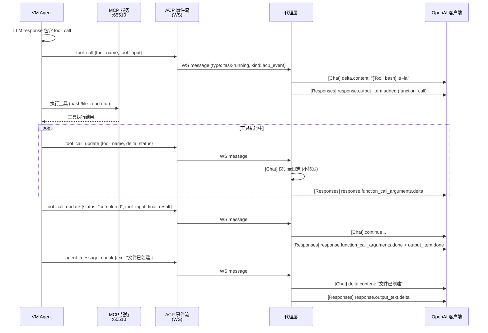

# Agent 工具调用机制深度分析

> **所属分类:** P0 缺口 #2 — Agent 如何处理工具调用结果
> **关键发现:** 工具调用在两个层有完全不同的处理方式，Chat API 仅"透传"，Responses API 有完整生命周期管理

## 1. 工具调用的完整生命周期



## 2. 两个处理路径的根本差异

| 环节 | Chat API (`/v1/chat/completions`) | Responses API (`/v1/responses`) |
|------|----------------------------------|----------------------------------|
| `tool_call` 到来 | → 拼接为 `[Tool: {name}] {input}` 文本，混入 content delta | → `response.output_item.added` + `response.function_call_arguments.delta` |
| `tool_call_update` | **仅日志记录，不转发** | → 增量推送 `function_call_arguments.delta` |
| 工具完成 (status=completed) | Agent 继续输出文本 | → `function_call_arguments.done` + `output_item.done`，输出索引 +1 |
| 整体效果 | 工具调用和 Agent 文本混在一起，客户端没法区分 | 结构化事件，客户端能解析工具调用 |

## 3. Chat API 的"透传"模式（当前行为）

```typescript
// proxy/src/task-runner.ts:304-315 — Chat API 处理 tool_call
case "tool_call": {
  const toolName = acp.tool_name || "unknown"
  const toolInput = acp.tool_input || ""
  onChunk({
    id: chatId,
    object: "chat.completion.chunk",
    created: now,
    model: "monkeycode",
    choices: [{ index: 0, delta: { content: `[Tool: ${toolName}] ${toolInput}` }, finish_reason: null }],
  })
  break
}
```

Chat API 把所有工具调用**编码为纯文本**塞进 `delta.content`。客户端看到的是：
```
[Tool: bash] ls -la /workspace
文件列表: ...
[Tool: file_read] /workspace/index.ts
文件内容: ...
```
而非 OpenAI 原生 `tool_calls` 结构。这意味着 Codex 以外的标准 OpenAI SDK 客户端无法利用工具调用能力。

## 4. Responses API 的完整生命周期管理

```typescript
// proxy/src/api-routes.ts:217-260 — Responses API 的完整工具调用处理
// 状态变量
let currentOutputIndex = 0    // 当前正在输出的 item 索引
let currentCallId = ""        // 当前工具调用的 ID
let currentToolName = ""      // 当前工具名称

// tool_call 到来
currentCallId = `call_${acp.tool_name}_${Date.now()}`
sendEvent("response.output_item.added", {
  item: { type: "function_call", id: currentCallId, name: currentToolName, arguments: "" }
})
sendEvent("response.function_call_arguments.delta", { arguments: args })

// tool_call_update 到来
sendEvent("response.function_call_arguments.delta", { arguments: updateArgs })

// 工具完成
sendEvent("response.function_call_arguments.done", { arguments: finalArgs })
sendEvent("response.output_item.done", { ... })
currentOutputIndex++  // 切换到下一个输出项
```

**Responses API 的正确性是 MCP 工具调用成功的关键。**

## 5. 工具完成的状态检测

```typescript
// proxy/src/api-routes.ts:245
if (acp.status === "completed" || acp.status === "done") {
  // 工具调用完成：发送 done 事件 + 增加输出索引
}
```

从 ACP event reference 确认，`tool_call_update` 的 `status` 字段可以取这些值：

| 值 | 含义 | 代理的处理 |
|-----|------|-----------|
| `"running"` | 工具正在执行 | 增量推送 delta |
| `"success"` | 工具成功 | 可能触发完成逻辑 |
| `"error"` | 工具失败 | 可能触发完成逻辑 |
| `"completed"` | 工具完成 | 发送 done 事件 |
| `"done"` | 工具完成（别名） | 发送 done 事件 |

> ⚠️ **潜在缺陷**：当前代码只检查 `completed` / `done`，如果 Agent 发送 `status: "success"` 作为完成信号，工具调用永远不会被正确关闭。

## 6. MCP 工具的完整调用链

```mermaid
flowchart TB
    subgraph Agent["VM Agent"]
        LLM["LLM 返回 tool_call"]
        PARSE["解析工具名+参数"]
        EXECUTE["调用 MCP 服务<br/>POST :65510"]
        RESULT["接收工具结果"]
        SEND["发送 ACP 事件"]
    end
    subgraph MCP["MCP 内置服务"]
        BASH["bash<br/>执行 shell 命令"]
        FILE_R["file_read<br/>读取文件"]
        FILE_W["file_write<br/>写入文件"]
        GIT["git<br/>版本控制"]
    end
    subgraph WS["WebSocket 通道"]
        TC["tool_call<br/>{tool_name, tool_input}"]
        TCU["tool_call_update<br/>{status, delta}"]
    end

    LLM --> PARSE
    PARSE --> EXECUTE
    EXECUTE -->|bash 命令| BASH
    EXECUTE -->|读文件| FILE_R
    EXECUTE -->|写文件| FILE_W
    EXECUTE -->|git 操作| GIT
    BASH -->|执行结果| RESULT
    FILE_R -->|文件内容| RESULT
    FILE_W -->|写入结果| RESULT
    GIT -->|git 输出| RESULT
    RESULT --> SEND
    SEND --> TC
    loop 执行中
        SEND --> TCU
    end
```

## 7. 关键发现

| 发现 | 详情 | 影响 |
|------|------|------|
| **Chat API 工具调用是文本** | 所有 tool_call 被编码为 `[Tool: name] input` 文本 | 标准 OpenAI SDK 无法识别 |
| **Responses API 有完整生命周期** | output_item → delta → done | Codex 原生支持 |
| **tool_call_update 在 Chat API 中被丢弃** | 仅 console.log | 工具执行中间状态不可见 |
| **完成检测可能不完整** | 只检查 `completed`/`done`，可能漏 `success` | 工具调用不关闭 |
| **MCP 工具结果不返回 Agent** | 工具结果通过下一轮 agent_message_chunk 返回 | 无结构化的工具响应 |

## 8. 改进建议

1. **Chat API 应该支持 `tool_calls` 字段**（而不仅混入文本），让标准 OpenAI SDK 客户端的 Function Calling 正常工作
2. **`tool_call_update` 在 Chat API 中应转发为 `delta.tool_calls`**，与 OpenAI 实现一致
3. **完成状态检测应扩展**，加入 `"success"` 和 `"error"` 作为完成信号
4. **工具调用结果应结构化返回**，而非混入 agent_message_chunk

---

**更新状态:** ✅ 已分析完成
**更新文件:** docs/08-analysis-rounds/unknown-gaps-index.md