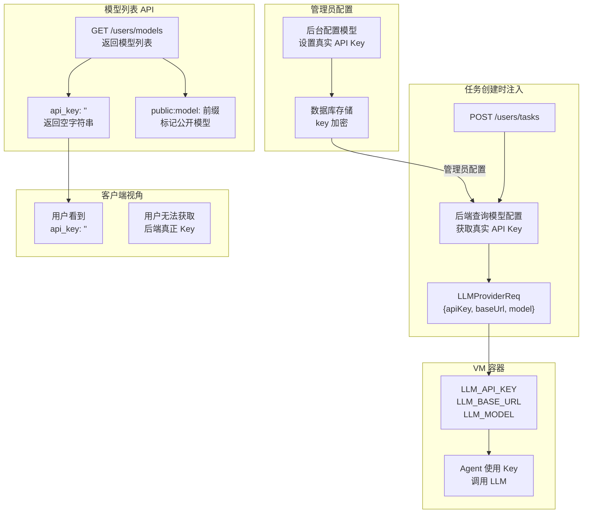
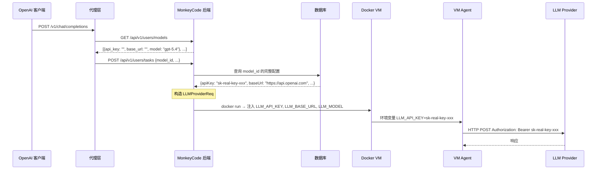

# ModelProvider API Key 注入机制

> **所属分类:** 新维度 #36 — API Key 注入机制
> **关键发现:** 后端在任务创建时自动注入真实 API Key 到 VM 容器，模型列表中的 `api_key=""` 是安全设计而非配置缺失

## 1. API Key 生命周期



## 2. 模型列表的 API Key 返回逻辑

```javascript
// 从线上实际 API 返回确认
// POST /api/v1/users/models 返回的模型对象：
{
  "api_key": "",         // 公开模型返回空
  "base_url": "",        // 公开模型返回空
  "provider": "BaiZhiCloud",
  "model": "gpt-5.4",
  "interface_type": "openai_responses",
  "owner": {
    "id": "admin",
    "type": "public",
    "name": "MonkeyCode-AI"
  }
}
```

**所有 37 个模型的 `api_key` 和 `base_url` 均为空。**

## 3. API Key 注入时序



## 4. 私有模型的 API Key 处理

```typescript
// proxy/src/types.ts:52-70 — MonkeyCodeModel
export interface MonkeyCodeModel {
  api_key: string      // 私有模型：用户自己填的 Key
  base_url: string     // 私有模型：用户自己填的 URL
  owner: OwnerType     // "private" | "team" | "public"
}

// 私有模型 vs 公开模型的行为差异
type="public"  → api_key="", base_url=""  → 后端自动注入
type="private" → api_key="sk-xxx"         → 用户自己提供
type="team"    → api_key="sk-xxx"         → 团队共享
```

## 5. 关键发现

| 发现 | 详情 | 影响 |
|------|------|------|
| **空 api_key 是安全设计** | 防止前端/代理偷拿 Key | ✅ 正确设计 |
| **后端在任务创建时注入** | VM 容器内才拿到真实 Key | ✅ 安全 |
| **私有模型由用户提供 Key** | 用户可以在 Dashboard 里配 | ✅ 灵活 |
| **public:model: 前缀** | 标记哪些模型是公开的 | 可用于客户端识别 |
| **模拟模式** | api_key="" 时返回 mock 数据 | 开发测试用 |
| **Agent 通过环境变量获取 Key** | LLM_API_KEY 注入容器 | ✅ Docker 标准做法 |

---

**更新状态:** ✅ 新维度已分析完成
**更新索引:** docs/08-analysis-rounds/unknown-gaps-index.md