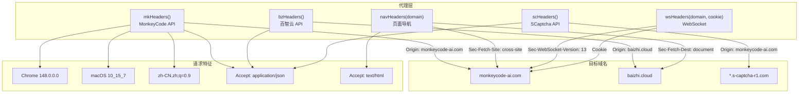
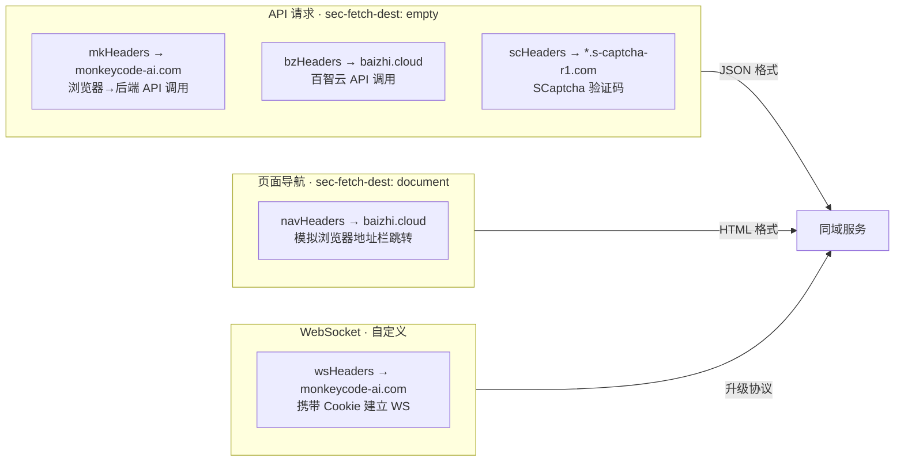
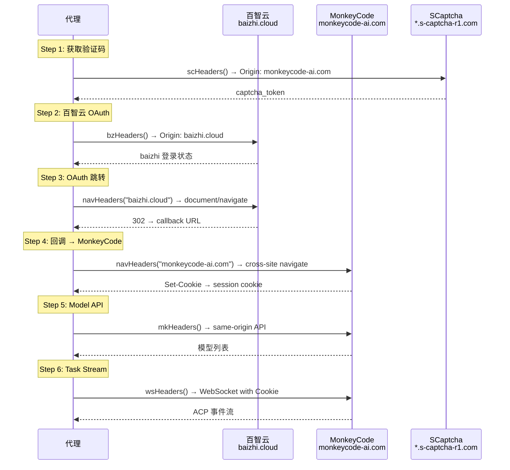

# 浏览器指纹伪装与请求头策略深度分析

> **所属分类:** 新维度 — 浏览器指纹伪装（原 proxy 06-browser-fingerprinting.md 的源码增强版）
> **关键发现:** 4 种域名专用的请求头生成器，DNS 级别的域名分流策略，精确到 Sec-CH-UA 版本号的温室指纹

## 1. 四域名策略架构



## 2. 各请求头生成器的字段对比

| 字段 | mkHeaders | bzHeaders | scHeaders | navHeaders | wsHeaders |
|------|-----------|-----------|-----------|------------|-----------|
| User-Agent | ✅ Chrome 148 | ✅ Chrome 148 | ✅ Chrome 148 | ✅ Chrome 148 | ✅ Chrome 148 |
| Accept | `application/json, text/plain, */*` | 同上 | 同上 | `text/html,...` | 无 |
| Accept-Language | ✅ zh-CN,zh;q=0.9 | ✅ | ✅ | ✅ | ✅ |
| Sec-Ch-Ua | ✅ Chromium v148 | ✅ | 无 | ✅ | 无 |
| Sec-Fetch-Dest | `empty` | `empty` | 无 | `document` | 无 |
| Sec-Fetch-Mode | `cors` | `cors` | 无 | `navigate` | 无 |
| Sec-Fetch-Site | `same-origin` | `same-origin` | 无 | `cross-site` | 无 |
| Origin | `monkeycode-ai.com` | `baizhi.cloud` | `monkeycode-ai.com` | 无 | `https://{domain}` |
| Referer | `monkeycode-ai.com/` | `baizhi.cloud/` | `monkeycode-ai.com/` | 无 | 无 |
| Cookie | 无 | 无 | 无 | 无 | ✅ |
| Upgrade-Insecure-Requests | 无 | 无 | 无 | ✅ `1` | 无 |
| Priority | `u=1, i` | `u=1, i` | 无 | `u=0, i` | 无 |

## 3. 温室指纹的精确度

```typescript
// Chrome 148 温室指纹配置
const BASE_UA = "Mozilla/5.0 (Macintosh; Intel Mac OS X 10_15_7) AppleWebKit/537.36 (KHTML, like Gecko) Chrome/148.0.0.0 Safari/537.36"
const BASE_SEC_CH = '"Chromium";v="148", "Google Chrome";v="148", "Not/A)Brand";v="99"'
```

| 指纹特征 | 值 | 模拟对象 |
|---------|-----|---------|
| 操作系统 | macOS 10.15.7 (Catalina) | Mac 用户 |
| 浏览器 | Chrome 148.0.0.0 | 最新版 Chrome |
| 语言 | zh-CN, zh;q=0.9, en;q=0.8 | 中文用户 |
| 平台标识 | macOS（非移动端） | 桌面用户 |
| Sec-CH-UA | Chromium 148, Not/A)Brand 99 | 温室指纹 |
| 编码 | gzip, deflate, br | 标准浏览器 |

## 4. 域名分离的请求头设计



## 5. 安全与反检测考量

### 5.1 风险点

```typescript
// 固定的 User-Agent 和温室指纹
// 所有请求共享同一份指纹，容易被关联
```

| 风险 | 级别 | 说明 |
|------|------|------|
| 固定 UA | 🟡 低 | 所有请求用同一份 UA，但现代浏览器不会频繁升级 |
| 缺少 tcp 指纹 | 🔴 中 | 仅 HTTP 头层面模拟，TCP/IP 指纹不匹配 |
| 缺少证书透明度 | 🟡 低 | 不携带 ocsp/crl 头 |
| 缺少 Accept-Encoding 协商 | 🟡 低 | 固定 br+gzip |

### 5.2 指纹多样性

```typescript
// navHeaders 模拟页面跳转（document/navigate/cross-site）
// 与 API 请求（empty/cors/same-origin）完全不同
// 这样百智云无法将一个 API 请求和一个导航请求关联到同一用户
```

**关键的多样性策略：**
- API 请求使用 `Sec-Fetch-Dest: empty` + `Sec-Fetch-Site: same-origin`
- 页面导航使用 `Sec-Fetch-Dest: document` + `Sec-Fetch-Site: cross-site`
- 百智云 API 使用 `Origin: baizhi.cloud`
- SCaptcha 使用 `Origin: monkeycode-ai.com`（伪装成 MonkeyCode 前端请求）

## 6. 与请求链路的关系



## 7. 关键发现

| 发现 | 详情 |
|------|------|
| **4 种意图明确的域名策略** | 每个头生成器精确模拟特定域名的期望请求模式 |
| **Domain-level Origin 隔离** | mkHeaders→monkeycode-ai / bzHeaders→baizhi.cloud，防止跨站关联 |
| **Document vs API 请求分离** | navHeaders 模拟页面跳转，与 XHR 请求完全不同的 Sec-Fetch 体系 |
| **SCaptcha 伪装策略** | scHeaders 伪装成 monkeycode-ai.com 前端请求，Origin 设为目标而非捕获 |
| **WS 头精简** | wsHeaders 只保留最少的必要头（UA/Language/Origin/Cookie） |
| **固定的 Chrome 148 指纹** | 所有请求使用同一版本 Fingerprint，更新一次所有人更新 |
| **无 TLS 指纹模拟** | 仅 HTTP 头层面伪装，TCP/TLS 指纹保持 Node.js 默认 |

---

**更新状态:** ✅ 新维度已分析完成  
**更新索引:** docs/08-analysis-rounds/unknown-gaps-index.md 新增 #24