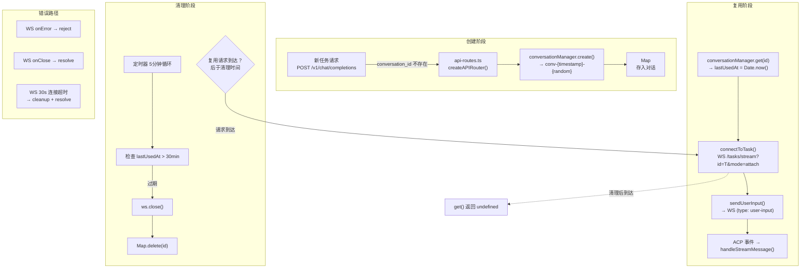
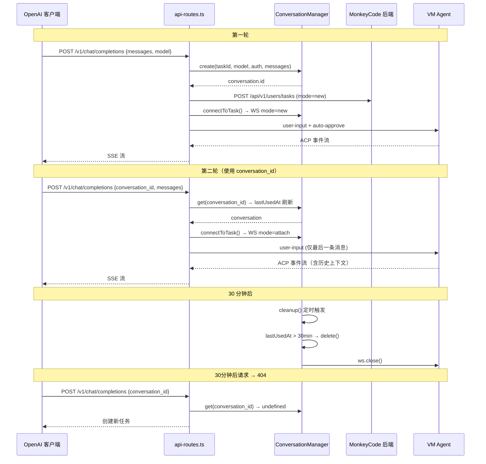
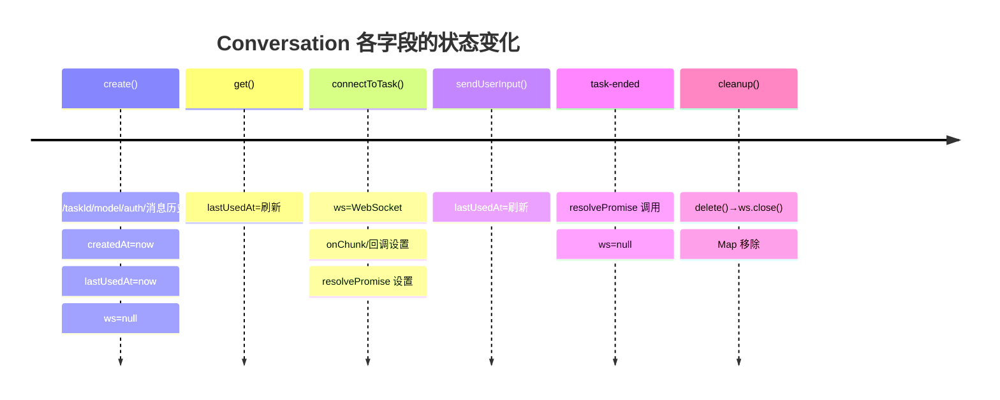

# Conversation Manager 清理与超时机制深度分析

> **所属分类:** 新维度 #25 — Conversation Manager 清理与超时
> **关键发现:** 30 分钟超时 + 5 分钟清理循环 + mode=attach 复用，存在 4 个竞态条件缺陷

## 1. 对话生命周期



## 2. 核心机制详解

### 2.1 清理循环

```typescript
// proxy/src/conversation-manager.ts:45-50
constructor(options) {
  this.conversationTimeoutMs = options?.conversationTimeoutMs || 30 * 60 * 1000  // 30min

  const cleanupInterval = options?.cleanupIntervalMs || 5 * 60 * 1000  // 5min
  this.cleanupTimer = setInterval(() => this.cleanup(), cleanupInterval)
}
```

| 参数 | 环境变量? | 默认值 | 说明 |
|------|----------|--------|------|
| `conversationTimeoutMs` | ❌ 不可配置 | 1,800,000 (30 min) | 对话最长空闲时间 |
| `cleanupIntervalMs` | ❌ 不可配置 | 300,000 (5 min) | 清理周期 |

### 2.2 清理逻辑

```typescript
// proxy/src/conversation-manager.ts:108-116
private cleanup(): void {
  const now = Date.now()
  for (const [id, conversation] of this.conversations) {
    if (now - conversation.lastUsedAt > this.conversationTimeoutMs) {
      this.delete(id)  // 关闭 WS + 从 Map 删除
    }
  }
}
```

### 2.3 mode=attach WebSocket 连接

```typescript
// proxy/src/conversation-manager.ts:136-142
connectToTask(conversation, onChunk) {
  const wsUrl = `${wsBaseUrl}/api/v1/users/tasks/stream?id=${conversation.taskId}&mode=attach`
  const ws = new WebSocket(wsUrl, { headers: wsHeaders(...) })

  conversation.ws = ws
  conversation.onChunk = onChunk
  conversation.resolvePromise = resolve
  conversation.rejectPromise = reject
}
```

**mode=attach 与 mode=new 的区别：**

| 模式 | 用途 | 行为 |
|------|------|------|
| `mode=new` | 首次任务 | 创建新 VM，启动 Agent |
| `mode=attach` | 复用任务 | 连接到已有 VM，保留 Agent 上下文 |

## 3. 多轮对话流程图



## 4. Conversation 数据结构

```typescript
export interface Conversation {
  id: string                    // conv-{timestamp}-{random6}
  taskId: string                // 后端任务 UUID
  model: MonkeyCodeModel        // 模型（整个对象）
  auth: AuthManager             // 账号认证（含 Cookie）
  ws: WebSocket | null          // WS 连接（null=未连接）
  messages: OpenAIMessage[]     // 消息历史（复制）
  lastUsedAt: number            // 最近使用（用于超时判定）
  createdAt: number             // 创建时间
  onChunk: ((chunk) => void) | null      // SSE 回调
  resolvePromise: (() => void) | null     // Promise 控制
  rejectPromise: ((err: Error) => void) | null
}
```

**字段的生命周期线：**



## 5. 关键缺陷

### 缺陷 1: get() 和清理之间的竞态条件

```typescript
// 竞态时序：
// T1: cleanup() 检查 lastUsedAt → 过期 → delete()
// T2: get(id) 被调用 → Map 已删除 → undefined
// T3: 客户端收到 404
```

**概率:** 低。`get()` 先刷新 `lastUsedAt` 再检查，但清理是独立的定时器。窗口期 ≈ 5 分钟。

### 缺陷 2: 资源泄漏 — VM 不被清理

```typescript
delete(id) {
  conversation.ws.close()  // 只关本地 WS
  this.conversations.delete(id)  // 只删本地 Map
  // ❌ 不调用 stopTask(taskId)
  // ❌ 远端 VM 继续运行
}
```

后果：VM 继续运行直到 `resource.life` (1 小时) 超时。

### 缺陷 3: WebSocket 连接超时 vs 对话超时

```typescript
// WS 连接超时 = 30 秒 (hardcoded)
setTimeout(() => { cleanup(); resolve() }, 30000)

// 对话清理超时 = 30 分钟（可配置）
const conversationTimeoutMs = options?.conversationTimeoutMs || 30 * 60 * 1000
```

**30 秒 WS 超时是硬编码的**，不可配置。当后端响应慢时可能导致连接被提前切断。

### 缺陷 4: 没有最大对话数量限制

```typescript
// 没有 maxConversations 检查
create(...) {
  // 无限制地创建新对话
  const id = `conv-${Date.now()}-${Math.random().toString(36).slice(2, 8)}`
  this.conversations.set(id, conversation)
}
```

**风险:** 大量创建对话而不复用，可能导致内存泄漏。每个对话持有整个消息历史 + 模型对象 + AuthManager。

## 6. 配置参数对比

| 参数 | 默认值 | 硬编码? | 环境变量可配? |
|------|--------|---------|-------------|
| 对话超时 | 30 min | ✅ 可配置 | ❌ 仅构造函数 |
| 清理间隔 | 5 min | ✅ 可配置 | ❌ 仅构造函数 |
| WS 连接超时 | 30 sec | ✅ 硬编码 | ❌ |
| 最大对话数 | ∞ | ✅ 无限制 | ❌ |
| VM 清理 | 自动(1h) | ❌ 依赖远端 | ❌ |

## 7. 改进建议

1. **对话数上限** — 增加 `maxConversations` 配置，超限时 LRU 淘汰最旧的
2. **清理时关闭远端 VM** — `delete()` 中调用 `taskRunner.stopTask(taskId)`
3. **WS 超时可配置** — 通过构造函数或环境变量暴露
4. **原子化 get+refresh** — 在 get() 中原子刷新 lastUsedAt 后立即检查超时，避免清理窗口

---

**更新状态:** ✅ 新维度已分析完成  
**更新索引:** docs/08-analysis-rounds/unknown-gaps-index.md