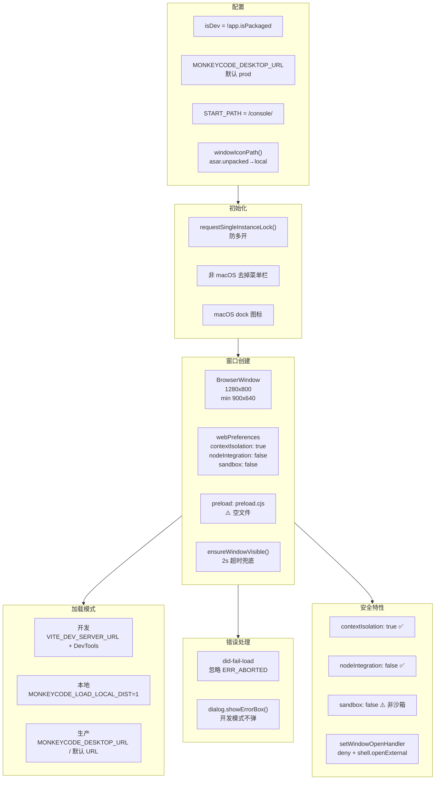

# Electron 桌面壳安全架构与启动流程

> **所属分类:** 新维度 #35 — Electron preload.cjs 安全层分析
> **关键发现:** 仅 138 行的极薄浏览器壳，"空心化"设计，安全配置良好但 preload.cjs 完全空置

## 1. 桌面壳架构



## 2. 安全配置审计

| 配置 | 值 | 安全等级 | 说明 |
|------|-----|---------|------|
| `contextIsolation` | `true` | ✅ 安全 | 渲染进程无法访问 Node.js API |
| `nodeIntegration` | `false` | ✅ 安全 | 禁止 require() |
| `sandbox` | `false` | ⚠️ 非沙箱 | 代码注释解释了原因 |
| `preload` | `preload.cjs` | ⚠️ **完全空文件** | 未暴露任何 API |
| `setWindowOpenHandler` | `deny` | ✅ 安全 | 阻止弹出窗口 |
| `shell.openExternal` | 允许 | 🟡 中 | 外部链接风险 |

## 3. preload.cjs 空文件的影响

```javascript
// preload.cjs — 只有 2 行
"use strict"
// Preload：若需向页面暴露安全 API，请使用 contextBridge.exposeInMainWorld。
```

**完全空置意味着：**
- 渲染进程无法通过 `window.electronAPI` 调用任何本地能力
- 所有文件操作、剪贴板、系统对话框等都需要通过 HTTP API
- Electron 壳退化为"纯浏览器壳"

## 4. 3 种加载模式

```javascript
// 开发模式
const devBase = process.env.VITE_DEV_SERVER_URL || "http://localhost:11180"
win.loadURL(desktopEntryUrl(devBase))
win.webContents.openDevTools({ mode: "detach" })

// 本地构建模式
win.loadFile(localDistIndexHtml())

// 生产模式（默认）
const base = process.env.MONKEYCODE_DESKTOP_URL || DEFAULT_PROD_URL
win.loadURL(desktopEntryUrl(base))
```

## 5. 关键发现

| 发现 | 详情 |
|------|------|
| **极薄壳（138 行）** | 只是给 Web 应用套了个窗口 |
| **preload.cjs 完全为空** | 无任何暴露 API，壳与 Web 完全隔离 |
| **安全配置良好** | contextIsolation=true, nodeIntegration=false |
| **sandbox=false 有理由** | Web 应用加载需要非沙箱 |
| **单实例锁** | requestSingleInstanceLock 防多开 |
| **多平台菜单处理** | Windows/Linux 去菜单，macOS dock 图标 |
| **2s 窗口显示兜底** | ready-to-show 不触发时强制显示 |
| **加载失败友好提示** | 开发模式不弹对话框，生产模式弹中文提示 |

---

**更新索引:** docs/08-analysis-rounds/unknown-gaps-index.md ✅