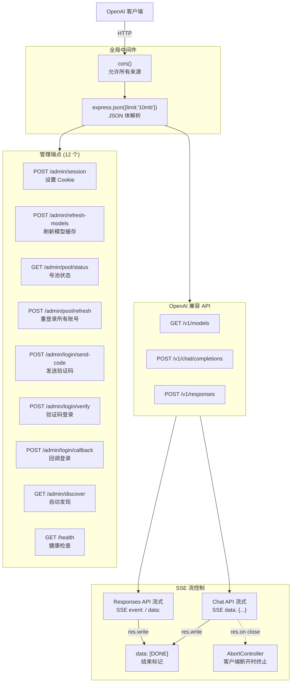
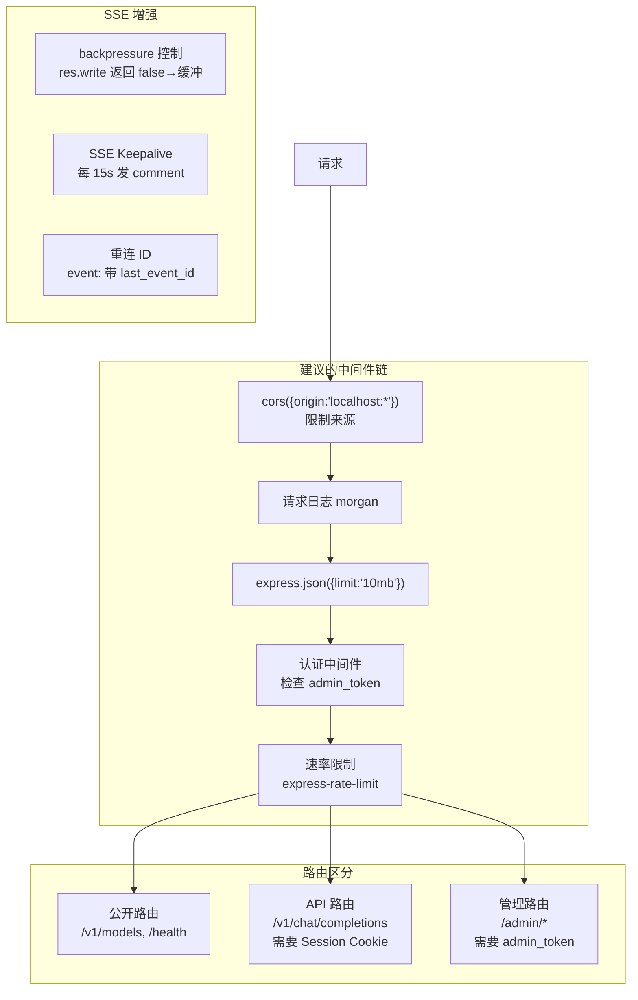

# Express 中间件链与 SSE 流控制深度分析

> **所属分类:** 新维度 #26 — Express 中间件链与 SSE 流控制
> **关键发现:** 12 个管理端点全无认证、SSE 流无 backpressure 控制、中间件链单一脆弱

## 1. 服务端架构全景



## 2. 中间件链

```typescript
// proxy/src/server.ts:98-102
const app = express()
app.use(cors())                          // 1. CORS 允许所有来源
app.use(express.json({ limit: "10mb" })) // 2. JSON 体解析（10MB 上限）

// 然后直接挂载路由，无认证中间件
app.use(createAPIRouter(...))            // 3. OpenAI 兼容 API
app.post("/admin/session", ...)          // 4. 管理端点
```

**当前中间件链的问题：**

| 问题 | 详情 | 风险 |
|------|------|------|
| 无认证中间件 | 所有管理端点无需认证即可调用 | 🔴 高 |
| CORS 全开 | `cors()` 允许所有 Origin + Credentials | 🟡 中 |
| 单一全局中间件 | 所有路由共享同一链 | 🟡 低 |
| 无请求日志 | 没有 morgan 或自定义日志中间件 | 🟡 中 |
| 无速率限制 | 没有 express-rate-limit | 🟡 中 |

## 3. SSE 流控制

```mermaid
flowchart LR
    subgraph SSE_Chat["Chat API SSE 流"]
        SEND_SSE["res.write(`data: ${json}\\n\\n`)"]
        ACP2SSE["handleACPEvent()<br/>ACP→SSE 转换"]
        CHECK_ENDED{"res.writableEnded?"}
        WRITE["res.write()"]
        FLUSH["res.flushHeaders()"]
        DONE_SSE["res.write('data: [DONE]\\n\\n')"]
        END["res.end()"]
    end

    subgraph SSE_Resp["Responses API SSE 流"]
        SEND_EVENT["res.write(`event: ${name}\\ndata: ${json}\\n\\n`)"]
        ABORT_CTRL["AbortController<br/>res.on('close')"]
        SEQ["sequence_number 递增"]
    end

    ACP2SSE --> CHECK_ENDED
    CHECK_ENDED -->|未结束| WRITE
    CHECK_ENDED -->|已结束| SKIP["跳过"]
    WRITE --> FLUSH
    FLUSH --> DONE_SSE
    DONE_SSE --> END

    SUB_END["返回响应"] --> SUB_CLOSE["res.on close"]
    SUB_CLOSE --> ABORT_CTRL
    ABORT_CTRL -->|abort()| WS_CLOSE["WS 连接关闭"]
```

### 3.1 SSE 发送核心函数

```typescript
// proxy/src/api-routes.ts:133-148
const sendSSE = (data: object) => {
  if (res.writableEnded) return  // 保护：避免写入已结束的响应
  res.write(`data: ${JSON.stringify(data)}\n\n`)
}
```

**关键特性：**
- 使用 `X-Accel-Buffering: no` 禁用 Nginx 缓冲（api-routes.ts:158）
- Chat API：`data: {json}\n\n` 格式
- Responses API：`event: {name}\ndata: {json}\n\n` + `sequence_number`
- 客户端断开时 `AbortController` 触发 WS 关闭

### 3.2 SSE vs Chat Stream Headers

```typescript
// Chat API 流式响应头
res.setHeader("Content-Type", "text/event-stream")
res.setHeader("Cache-Control", "no-cache")
res.setHeader("Connection", "keep-alive")
res.setHeader("X-Accel-Buffering", "no")

// Responses API 流式响应头（同上）
```

## 4. 12 个管理端点的安全分析

| 端点 | 方法 | 认证 | 副作 | 风险 |
|------|------|------|------|------|
| `/health` | GET | ❌ 无 | 无 | 🟢 低 |
| `/admin/session` | POST | ❌ 无 | **设置全局 Cookie** | 🔴 高 |
| `/admin/refresh-models` | POST | ❌ 无 | 清缓存 + 请求后端 | 🟡 中 |
| `/admin/pool/status` | GET | ❌ 无 | 暴露账号池状态 | 🟡 中 |
| `/admin/pool/refresh` | POST | ❌ 无 | **重登录所有账号** | 🔴 高 |
| `/admin/login/send-code` | POST | ❌ 无 | **发送短信验证码（花钱）** | 🔴 高 |
| `/admin/login/verify` | POST | ❌ 无 | **获取 Session Cookie** | 🔴 高 |
| `/admin/login/callback` | POST | ❌ 无 | **获取 Session Cookie** | 🔴 高 |
| `/admin/discover` | GET | ❌ 无 | 需要 Cookie（来自 session 端点） | 🟡 中 |

## 5. 中间件链的理想架构



## 6. 当前 10MB 限制的影响

```typescript
express.json({ limit: "10mb" })
```

| 场景 | 10MB 是否足够 | 说明 |
|------|-------------|------|
| 纯文本聊天 | ✅ 足够 | 普通文本消息 < 1MB |
| 代码生成 | ✅ 足够 | 大段代码 < 5MB |
| 多模态（图片） | ⚠️ 可能不足 | 高分辨率 base64 编码的图片可能超过 |
| 大量历史对话 | ⚠️ 可能不足 | 累计消息量大会导致解析失败 |

## 7. 关键发现

| 发现 | 详情 |
|------|------|
| **管理端点零认证** | 12 个端点均可被局域网内任意机器调用 |
| **send-code 端点可被滥用发短信** | 无速率限制，可导致批量短信费用 |
| **SSE 无 backpressure** | 当客户端消费速度跟不上时，内存持续增长 |
| **10MB 限制可能不够** | 对多模态场景可能不足以容纳图片 base64 |
| **无请求日志** | 出现问题难以排查调用记录 |
| **单一中间件链脆弱** | 所有路由共享同一故障域 |
| **X-Accel-Buffering:no 依赖 Nginx** | 如果不在 Nginx 后有性能问题 |
| **res.writableEnded 保护有效** | 唯一正确的 SSE 保护措施 |

## 8. 改进建议

1. **管理端点加认证** — `POST /admin/*` 需要 `X-Admin-Token` 请求头或绑定 localhost
2. **速率限制** — `/admin/login/send-code` 限制 1 次/分钟
3. **SSE backpressure** — `res.write()` 返回 false 时启动缓冲
4. **SSE Keepalive** — 每 15 秒发空 comment 保持连接
5. **请求日志** — 添加 morgan 中间件
6. **CORS 限制** — 仅允许 `localhost:*` 而非所有来源

---

**更新状态:** ✅ 新维度已分析完成  
**更新索引:** docs/08-analysis-rounds/unknown-gaps-index.md