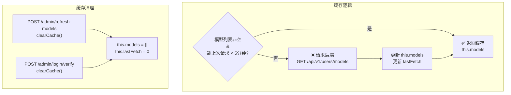

# model_id 6 层解析回退的精确行为

> **所属分类:** 新维度 #28 — model_id 6 层解析回退
> **关键发现:** 6 层回退设计巧妙但有 3 个隐蔽缺陷：大小写敏感、display_name 空值、第一兜底可能匹配错误模型

## 1. 6 层解析回退架构

```mermaid
flowchart TB
    subgraph Input["客户端请求"]
        ID["model: 'monkeycode/BaiZhiCloud/gpt-5.4'"]
    end

    subgraph Layer1["L1: 精确匹配"]
        EXACT["`monkeycode/${provider}/${model}`<br/>=== openaiModelId"]
    end

    subgraph Layer2["L2: Provider/Model 匹配"]
        PM["`${provider}/${model}`<br/>=== openaiModelId"]
    end

    subgraph Layer3["L3: Model 名称匹配"]
        MN["model.name === openaiModelId<br/>大小写敏感"]
    end

    subgraph Layer4["L4: Display Name 匹配"]
        DN["display_name === openaiModelId<br/>大小写敏感"]
    end

    subgraph Layer5["L5: 默认模型"]
        DEF["is_default === true"]
    end

    subgraph Layer6["L6: 第一个可用模型"]
        FIRST["models[0] || null"]
    end

    subgraph Fail["解析失败"]
        NULL["return null<br/>→ 客户端收到 404"]
    end

    ID --> Layer1
    Layer1 -->|命中| DONE["✅ 返回 MonkeyCodeModel"]
    Layer1 -->|未命中| Layer2
    Layer2 -->|命中| DONE
    Layer2 -->|未命中| Layer3
    Layer3 -->|命中| DONE
    Layer3 -->|未命中| Layer4
    Layer4 -->|命中| DONE
    Layer4 -->|未命中| Layer5
    Layer5 -->|命中| DONE
    Layer5 -->|未命中| Layer6
    Layer6 -->|找到| DONE
    Layer6 -->|空列表| NULL
```

## 2. 每层匹配的精确条件

```typescript
// proxy/src/models.ts:64-90
async resolveModel(openaiModelId: string): Promise<MonkeyCodeModel | null> {
  const models = await this.fetchModels()

  // L1: monkeycode/BaiZhiCloud/gpt-5.4
  const exact = models.find((m) => this.toOpenAIModelId(m) === openaiModelId)
  if (exact) return exact

  // L2: BaiZhiCloud/gpt-5.4
  const byProviderModel = models.find((m) => `${m.provider}/${m.model}` === openaiModelId)
  if (byProviderModel) return byProviderModel

  // L3: gpt-5.4
  const byModelName = models.find((m) => m.model === openaiModelId)
  if (byModelName) return byModelName

  // L4: display_name 匹配
  const byDisplayName = models.find((m) => m.display_name === openaiModelId)
  if (byDisplayName) return byDisplayName

  // L5: is_default
  const defaultModel = models.find((m) => m.is_default)
  if (defaultModel) return defaultModel

  // L6: 第一个
  return models[0] || null
}
```

## 3. 每一层的客户端输入示例

| 层 | 客户端输入示例 | 命中条件 | 匹配复杂度 |
|----|--------------|---------|-----------|
| L1 | `monkeycode/BaiZhiCloud/qwen3.5-plus` | 完整前缀+provider+model | 精确匹配 |
| L2 | `BaiZhiCloud/qwen3.5-plus` | `/` 分割的两个字段 | 精确匹配 |
| L3 | `qwen3.5-plus` | 单字段匹配 model 名 | 精确匹配（可能误配） |
| L4 | `通义千问 Qwen3.5` | display_name 精确匹配 | 较弱（可能为空） |
| L5 | 任意值 | is_default 标记 | 弱（返回默认模型） |
| L6 | 任意值 | 第一个有值 | 最弱（随机匹配） |

## 4. 线上实测的模型 ID 示例

```javascript
// 从线上实际获取的 37 个模型
// ID 格式: monkeycode/{provider}/{model}
const modelIds = [
  "monkeycode/BaiZhiCloud/monkeycode-pro/minimax-m2.7",
  "monkeycode/BaiZhiCloud/kimi-k2.6",
  "monkeycode/BaiZhiCloud/gpt-5.5",
  "monkeycode/BaiZhiCloud/monkeycode-pro",
  "monkeycode/BaiZhiCloud/qwen3.5-plus",
  // ... 共 37 个
]

// L1 匹配示例:
resolveModel("monkeycode/BaiZhiCloud/qwen3.5-plus") → ✅ 直接命中

// L2 匹配示例:
resolveModel("BaiZhiCloud/qwen3.5-plus") → ✅ 命中 L2

// L3 匹配示例: 危险！
resolveModel("monkeycode-pro") → ❌ L1 未命中 → ❌ L2 未命中
  → → 匹配 L3: model.name === "monkeycode-pro"
  → → → **可能匹配到错误的模型！**
```

## 5. 3 个隐蔽缺陷

### 缺陷 1: L3 同名模型可能误配

```javascript
// 线上有多个 model 名称相同的模型（不同 provider）：
const model1 = { provider: "BaiZhiCloud", model: "glm-5", ... }
const model2 = { provider: "BaiZhiCloud", model: "glm-5", ... }  // 实际是同一个

// 但如果扩展到不同 provider：
// L3 匹配时只查 model 名，可能忽略 provider 差异
```

实际上是：37 个模型都来自 `BaiZhiCloud`，所以 L3 误配概率低。但如果扩展到多提供商，L3 可能匹配到错误 provider 的同名模型。

### 缺陷 2: `display_name` 可能为空

```typescript
// proxy/src/types.ts:67-68
name: string
display_name: string
```

从线上数据看，部分模型 `display_name` 为空字符串。当 L4 匹配 `"" === openaiModelId` 时，空字符串永远不会匹配非空用户输入，所以 L4 实际是安全的（只是永远跳过）。

### 缺陷 3: L6 兜底可能匹配错误模型

当所有 5 层都失败时，`models[0]` 返回的是**模型列表的第一个**，没有任何筛选逻辑。第一个模型可能是 `pro` 级别的付费模型，basic 用户拿到这个模型后会创建任务失败。

## 6. 缓存行为

```typescript
// proxy/src/models.ts:11-14
private cacheTTL: number = 5 * 60 * 1000  // 5 分钟缓存

fetchModels(): Promise<MonkeyCodeModel[]> {
  if (this.models.length > 0 && Date.now() - this.lastFetch < this.cacheTTL) {
    return this.models  // 缓存命中
  }
  // 缓存失效 → 请求后端
  const result = await fetch(...)
  this.models = result
  this.lastFetch = Date.now()
}
```



## 7. 关键发现

| 发现 | 详情 |
|------|------|
| **6 层回退覆盖所有输入格式** | 从完整 ID 到模糊名称都支持 |
| **L3 有误配风险** | model 名匹配忽略 provider，多提供商时可能匹配错 |
| **L4 (display_name) 实际无效** | 线上数据 display_name 多为空 |
| **L6 兜底可能暴露付费模型** | basic 用户拿到 pro 模型后任务会失败 |
| **5 分钟缓存合理** | 与模型变更频率匹配 |
| **缓存仅在 admin 端点触发清除** | 用户无法主动刷新模型列表 |
| **大小写敏感** | 所有匹配都是 `===`，无法处理大小写差异 |

## 8. 改进建议

1. **L3/L4 加大小写不敏感** — `.toLowerCase()` 比较
2. **L6 兜底按用户 access_level 过滤** — 只返回 basic 用户可用的模型
3. **L4 跳过空 display_name** — 避免不必要的比较
4. **增加 `resolveModel(modelId, accessLevel)` 参数** — 按用户等级过滤

---

**更新状态:** ✅ 新维度已分析完成
**更新索引:** docs/08-analysis-rounds/unknown-gaps-index.md