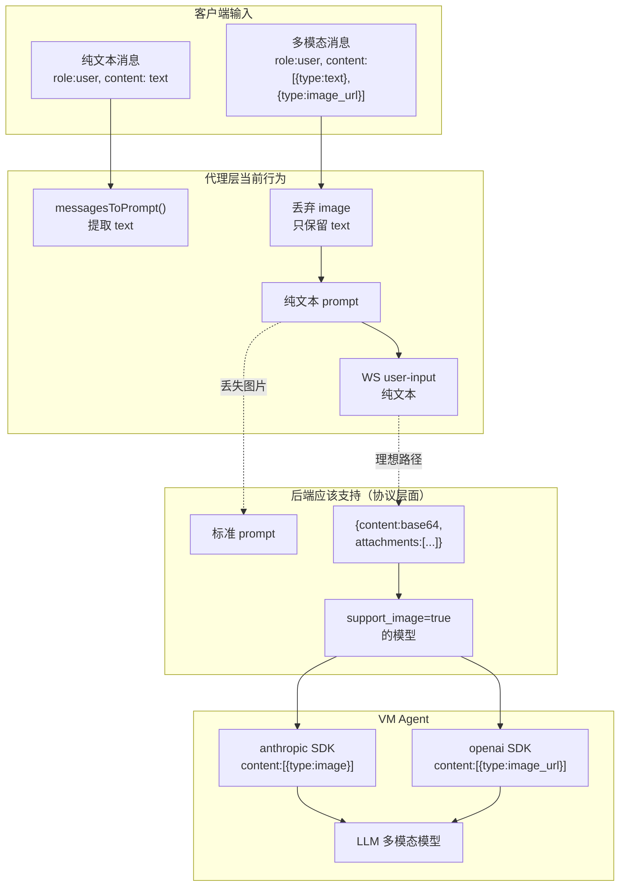

# 多模态输入支持分析

> **所属分类:** P0 缺口 #7 — Agent 是否支持多模态输入
> **关键发现:** 当前所有 37 个模型 `support_image=false`，代理层完全不支持图片输入

## 1. 线上实测数据（2026-07-05）

```python
# 从实际 API 获取的模型数据
support_image 分布: {False: 37}  # 0 个模型支持图片
```

所有 37 个模型的字段:

| 字段 | 值 | 含义 |
|------|-----|------|
| `interface_type` | anthropic / openai_responses | 接口类型 |
| `support_image` | **全部 False** | ❌ 不支持图片 |
| `thinking_enabled` | True/False | 是否支持推理 |
| `context_limit` | 0 | 未配置 |
| `output_limit` | 0 | 未配置 |
| `is_free` | False | 非免费 |
| `is_hidden` | True/False | 是否隐藏 |

> **结论:** 当前这个 MonkeyCode 实例（monkeycode-ai.com）**没有任何模型配置了多模态支持**。`support_image` 字段存在但全为 false。

## 2. 代理层对多模态的处理

### 2.1 代理层完全丢弃图片信息

```typescript
// proxy/src/api-routes.ts:354-368
function messagesToPrompt(messages: OpenAIMessage[]): string {
  return messages.map((m) => {
    // ... 只处理 role/content
    default:
      return m.content
  }).join("\n\n")
}
```

当 OpenAI 消息包含 `content: [{type:"image_url", image_url:{url:"data:image/png;base64,..."}}]` 格式时，当前代码会提取为纯文本：

```typescript
// proxy/src/api-routes.ts:143-146
if (Array.isArray(m.content)) {
  return m.content.filter((c: any) => c.type === "input_text").map((c: any) => c.text).join("")
  // 只提取 text 部分，image 部分完全丢弃
}
```

### 2.2 用户输入处理也丢弃图片

```typescript
// proxy/src/task-runner.ts:83
export interface UserInputMessage {
  type: "user-input",
  data: string // 纯文本或 JSON.stringify({content: base64, attachments: []})
}
```

`UserInputMessage` 的 `data` 字段注释提到支持 `{content: base64, attachments: []}` 格式，但当前代理**只发送纯文本**，没有实现图片附件的编码。

## 3. MonkeyCode 后端的多模态能力

### 3.1 support_image 字段存在且可配置

模型配置中包含 `support_image: boolean` 字段，说明后端设计时考虑了多模态支持。这个字段应该是管理员配置模型时手动设置的。

### 3.2 接口类型的多模态兼容性

| interface_type | 原生多模态支持 | 备注 |
|---------------|--------------|------|
| `anthropic` | ✅ Claude 3.5+ 支持图片 | `anthropic` SDK 支持 `content: [{type:"image",...}]` |
| `openai_chat` | ✅ GPT-4o 支持图片 | OpenAI API 支持 `content: [{type:"image_url",...}]` |
| `openai_responses` | ✅ GPT-4o 支持图片 | Responses API 同 |

### 3.3 UserInputMessage 的附件格式

```typescript
// proxy/src/types.ts:80-84
// UserInputMessage.data 的格式
// 当前: 纯文本字符串
// 理论上支持: JSON.stringify({
//   content: base64encodedPrompt,
//   attachments: [ {type:"image", url:"data:image/png;base64,..."} ]
// })
```

注释表明 MonkeyCode 后端在协议层面**支持附件**，只是当前代理没有实现。

## 4. 完整的多模态支持链路



## 5. 需要实现的多模态支持

### 5.1 messagesToPrompt 中保留图片

```typescript
function messagesToPrompt(messages: OpenAIMessage[]): string {
  return messages.map((m) => {
    if (typeof m.content === "string") {
      return `[${m.role}]\n${m.content}`
    }
    // 多模态消息：提取 text + 标记图片
    if (Array.isArray(m.content)) {
      const parts = m.content.map((c: any) => {
        if (c.type === "text") return c.text
        if (c.type === "image_url") return "[Image]"
        if (c.type === "input_text") return c.text
        if (c.type === "input_image") return "[Image]"
        return ""
      })
      return `[${m.role}]\n${parts.join("\n")}`
    }
    return m.content
  }).join("\n\n")
}
```

### 5.2 UserInputMessage 附件编码

```typescript
// 当模型 support_image=true 时，需要将图片编码为附件
interface Attachment {
  type: "image"
  url: string  // data:image/png;base64,...
}

// 发送 user-input
const attachments = extractImagesFromMessages(messages)
ws.send(JSON.stringify({
  type: "user-input",
  data: JSON.stringify({
    content: promptText,
    attachments: attachments.length > 0 ? attachments : undefined
  })
}))
```

## 6. 结论

| 发现 | 详情 | 影响 |
|------|------|------|
| **当前 0 个模型支持图片** | `support_image` 全部 False | 没必要实现多模态 |
| **协议层面支持附件** | UserInputMessage 有 attachments 字段 | 后端可处理 |
| **当前代理丢弃图片** | 仅提取 text，忽略 image | 代理层需增强 |
| **接口类型全部兼容多模态** | anthropic/openai_chat/responses 都支持 | 无技术障碍 |
| **主要障碍是配置缺失** | 无模型配置 support_image=true | 需管理员配置 |

> **最终结论:** 不是技术限制，是运营配置问题。如果管理员在后台模型中设置 `support_image=true` 并配置正确的多模态模型，整个链路是通顺的。但当前阶段，**实现多模态支持的优先级很低**。

---

**更新状态:** ✅ 已分析完成
**更新文件:** docs/08-analysis-rounds/unknown-gaps-index.md