# Python MVP OAuth HTTP 纯 HTTP 实现深度分析

> **所属分类:** 新维度 — Python MVP oauth_http.py 纯 HTTP OAuth 实现
> **关键发现:** 7 步 OAuth 流程完全脱离浏览器，与 TypeScript admin-login.ts 架构相同但实现差异显著

## 1. 7 步 OAuth HTTP 流程图

```mermaid
flowchart TB
    subgraph Phone["手机号登录模式 — phone_login_flow()"]
        S1["Step1: 获取 OAuth 重定向<br/>GET /api/v1/users/login → 302"]
        S2["Step2: 获取 SCaptcha token<br/>POST *.s-captcha-r1.com/v1/api/challenge"]
        S3["Step3: 发送短信验证码<br/>POST baizhi.cloud/api/v1/user/phone_code"]
        S4["Step4: 输入短信验证码<br/>input() 手动"]
        S5["Step5: 手机号登录百智云<br/>POST baizhi.cloud/api/v1/user/login/phone"]
        S6["Step6: OAuth 授权<br/>GET baizhi.cloud/api/v1/oauth/authorize → code"]
        S7["Step7: MonkeyCode 回调<br/>GET callback URL → session cookie"]
    end

    subgraph Callback["回调模式 — callback_flow()"]
        CB["直接使用回调 URL<br/>手动复制"]
    end

    subgraph Verify["验证模式 — --verify"]
        V1["verify_session()<br/>GET /api/v1/users/status"]
    end

    S1 --> S2 --> S3 --> S4 --> S5 --> S6 --> S7
```

## 2. 三种运行模式

| 模式 | 命令 | 流程 | 人工介入 |
|------|------|------|---------|
| 手机号登录 | `--phone 138xxx` | 7 步全自动 | 仅输入短信验证码 |
| 回调模式 | `--callback-url URL` | 1 步 | 手动复制回调 URL |
| 验证模式 | `--verify COOKIE` | 1 步 | 无 |

## 3. Python vs TypeScript 实现对比

| 维度 | Python oauth_http.py | TypeScript admin-login.ts |
|------|---------------------|--------------------------|
| 行数 | 372 | 416 |
| Cookie 管理 | requests.Session | 手动 Extract + Set |
| SCaptcha 处理 | `action="error"` 仍使用 token | TLS 绕过 + 自动获取 |
| 短信发送 | 独立函数 | `sendSmsCode()` |
| OAuth 状态 | 本地变量 | `currentOAuthSession` 全局单例 |
| 超时保护 | 无 | 10 分钟 TTL |
| 错误处理 | `if resp.status_code` 链 | try/catch |
| 状态持久化 | .session 文件 | 注入 AuthManager |

## 4. 关键发现

| 发现 | 详情 |
|------|------|
| **SCaptcha error 时 token 仍有效** | `action="error"` + `"no money"` 错误时 token 可用 |
| **百智云 Cookie 管理复杂** | 两次登录请求 + session.cookies 跟踪 |
| **无超时保护** | 与 admin-login.ts 的 10 分钟 TTL 不同 |
| **requests.Session 自动管理 Cookie** | Python 的会话管理比 TypeScript 手动处理更简洁 |
| **7 步流程与 TS 实现一致** | 步骤顺序和 API 端点完全相同 |

---

**更新索引:** docs/08-analysis-rounds/unknown-gaps-index.md ✅