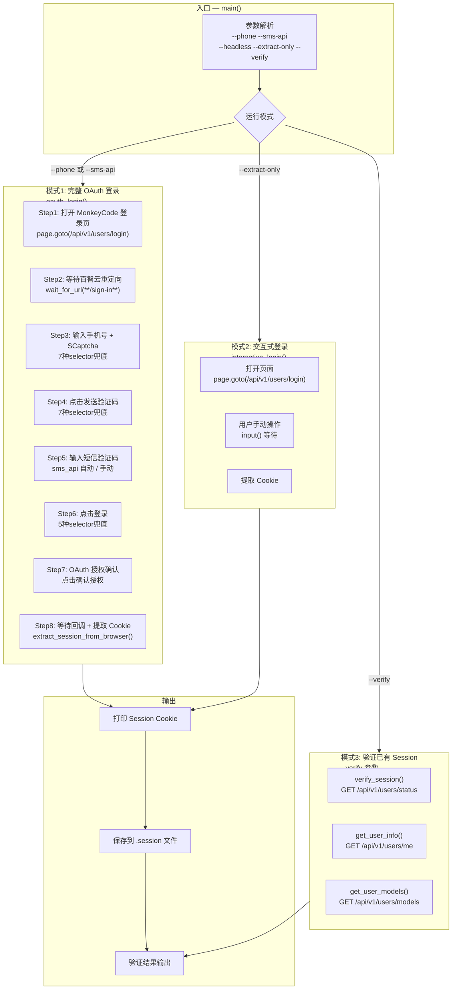
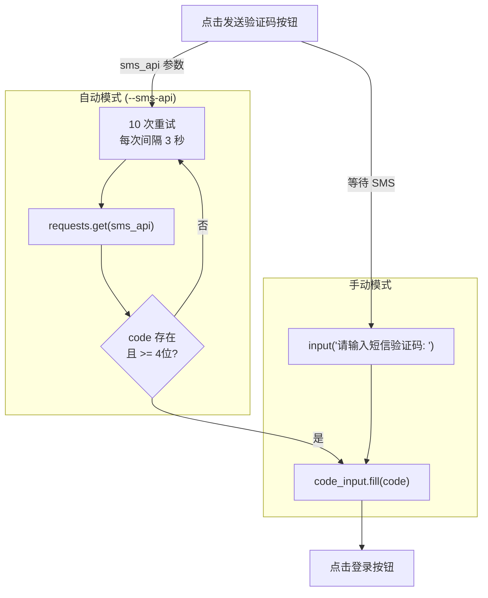
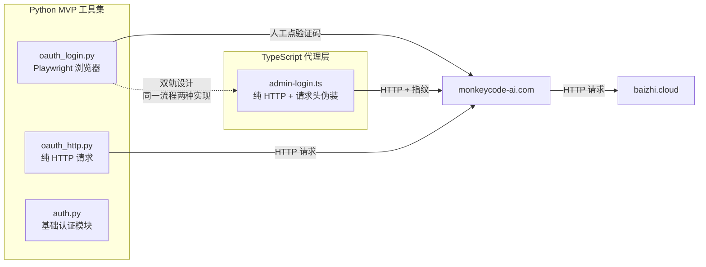

# Python MVP OAuth 登录自动化深度分析

> **所属分类:** 新维度 #31 — Python MVP oauth_login.py Playwright 自动化
> **关键发现:** Playwright 浏览器自动化 vs 纯 HTTP 实现的双轨设计，8 步登录流程，3 种运行模式

## 1. 架构全景



## 2. 双轨架构：Playwright 浏览器 vs 纯 HTTP

| 维度 | Playwright 实现 (oauth_login.py) | 纯 HTTP 实现 (admin-login.ts) |
|------|--------------------------------|------------------------------|
| **原理** | 真实浏览器 + Playwright 控制 | Node.js fetch + 请求头伪装 |
| **验证码** | 人工在浏览器里点 SCaptcha | TLS 绕过 + 自动获取 captcha token |
| **发短信** | Playwright 点击按钮 | HTTP POST 直接调百智云 API |
| **稳定性** | 依赖 DOM 选择器（脆弱） | 依赖 API 响应（稳定） |
| **速度** | 慢（需要浏览器启动 + 页面加载） | 快（纯网络请求） |
| **适用场景** | 开发调试、手动登录 | 自动化、账号池 |

## 3. DOM 选择器兜底策略

```python
# mvp/oauth_login.py:122-134 — 手机号输入框的 6 种兜底选择器
phone_input = None
for selector in [
    "input[type='tel']",
    "input[name='phone']",
    "input[placeholder*='手机']",
    "input[placeholder*='phone']",
    "input[id*='phone']",
]:
    phone_input = page.locator(selector).first
    if phone_input.is_visible(timeout=3000):
        break
```

**所有 DOM 操作都使用了类似的兜底策略（6-7 种选择器）：**

| 目标元素 | 兜底选择器数 | 脆弱性 |
|---------|------------|--------|
| 手机号输入框 | 6 种 | 🟡 百智云页面改版后可能全部失效 |
| 验证码按钮 | 7 种 | 🟡 同上 |
| 发送验证码按钮 | 6 种 | 🟡 同上 |
| 验证码输入框 | 4 种 | 🟡 同上 |
| 登录按钮 | 4 种 | 🟡 同上 |
| 授权确认按钮 | 4 种 | 🟡 同上 |

## 4. 短信验证码获取流程



## 5. 与纯 HTTP 实现的双轨架构



## 6. 关键发现

| 发现 | 详情 | 影响 |
|------|------|------|
| **3 种运行模式** | 完整 OAuth / 交互式提取 / Session 验证 | 覆盖所有使用场景 |
| **DOM 兜底策略** | 4-7 种选择器兜底每个元素 | 百智云改版可能全失效 |
| **sms_api 接口约定** | 期望返回 `{code: "123456"}` 或纯文本 | 无标准格式文档 |
| **无 headless + 手动验证码路径** | headless 模式要求 sms_api | 无人工介入时无法使用 |
| **Session 持久化** | 自动保存到 `.session` 文件 | 持久化方便后续使用 |
| **无重试机制** | 登录失败不重试 | 网络抖动可能失败 |
| **无超时配置** | 10 次 3s 的重试硬编码 | 不可配置 |

---

**更新状态:** ✅ 新维度已分析完成
**更新索引:** docs/08-analysis-rounds/unknown-gaps-index.md