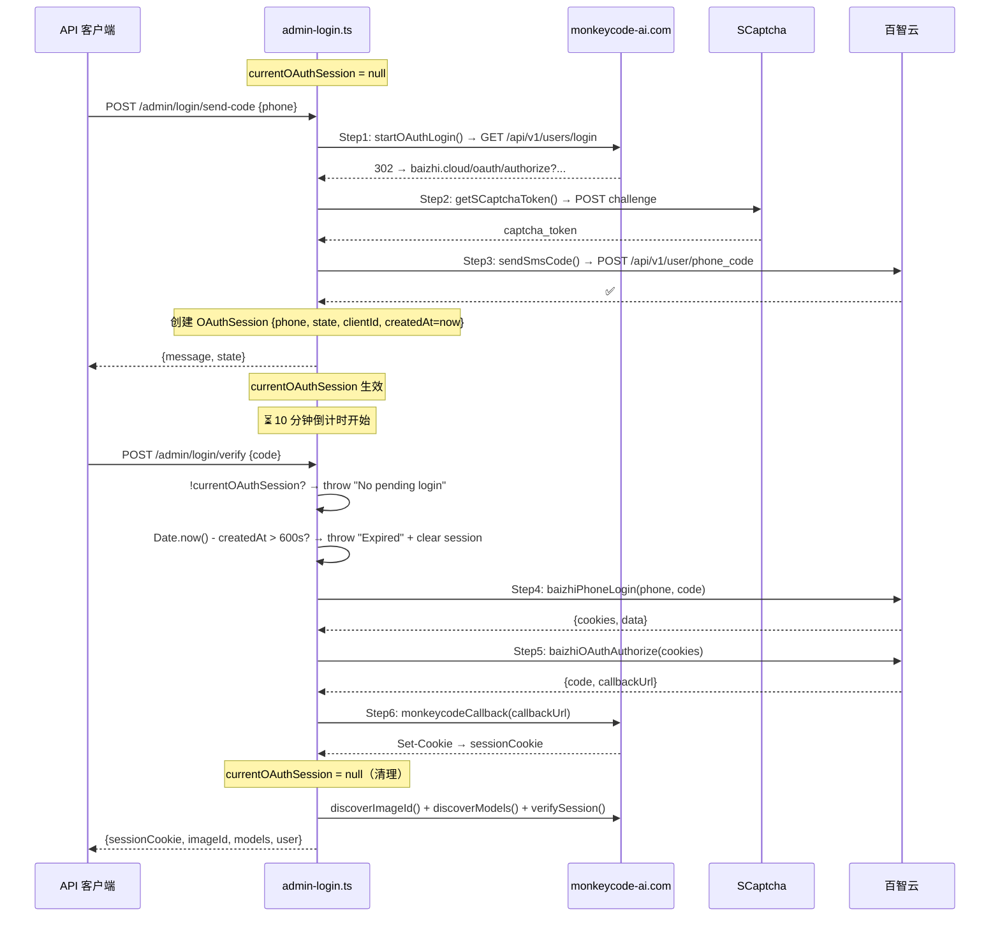
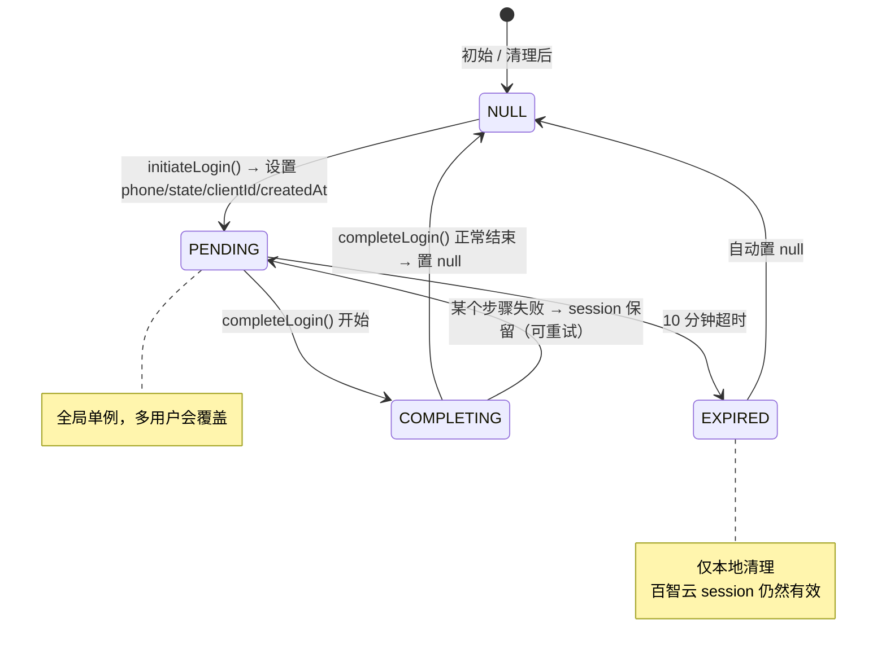

# OAuth 6 步超时保护与状态管理深度分析

> **所属分类:** 新维度 #29 — admin-login.ts OAuth 6 步超时保护
> **关键发现:** 10 分钟 OAuth session TTL + 全局单例状态变量，存在 3 个竞态条件缺陷

## 1. 6 步 OAuth 流程 + 超时保护



## 2. 全局 OAuth 会话状态

```typescript
// proxy/src/admin-login.ts:23-24
/** 全局 OAuth 会话存储 — 单例模式 */
let currentOAuthSession: OAuthSession | null = null
```

### OAuthSession 数据结构

```typescript
export interface OAuthSession {
  phone: string              // 手机号
  state: string              // OAuth state 参数
  clientId: string           // OAuth client_id
  redirectUri: string        // OAuth redirect_uri
  scope: string              // OAuth scope
  baizhiCookies: string      // 百智云登录后的 Cookie
  createdAt: number          // 创建时间戳（用于 TTL 检查）
}
```

## 3. 10 分钟 TTL 保护

```typescript
// proxy/src/admin-login.ts:343-346
if (Date.now() - currentOAuthSession.createdAt > 10 * 60 * 1000) {
  currentOAuthSession = null   // 清理状态
  throw new Error("Login session expired. Please request a new SMS code.")
}
```

| 参数 | 值 | 可变? |
|------|-----|-------|
| TTL | 600,000ms (10 min) | ❌ 硬编码 |
| 验证时机 | 每次调用 `completeLogin()` 时检查 | — |
| 清理动作 | 置 null + throw Error | — |

## 4. 全局状态的 3 个竞态条件

### 缺陷 1: 单例覆盖

```typescript
// 多用户同时登录时的竞态：
// 用户A: initiateLogin('13800138000')
//          → currentOAuthSession = {phone: '13800138000', ...}
// 用户B: initiateLogin('13900139000')
//          → currentOAuthSession = {phone: '13900139000', ...}  // ❌ 覆盖了 A 的 session
// 用户A: completeLogin('123456')
//          → 使用用户B的 session → SMS 验证码不匹配
```

**风险:** 🔴 高 — 任何并发 OAuth 登录都会互相覆盖

### 缺陷 2: 10 分钟超时后不清理百智云状态

```typescript
// 超时后只清理本地状态，百智云 Cookie 和 OAuth code 仍然有效
if (Date.now() - currentOAuthSession.createdAt > 10 * 60 * 1000) {
  currentOAuthSession = null  // 只清零本地
  // ❌ 不调用 baizhi 登出
  // ❌ 百智云的 session 仍然有效
}
```

### 缺陷 3: 成功登录后状态残留

```typescript
// completeLogin 正常结束时置 null
currentOAuthSession = null
// 但如果 completeLogin 在中途（Step5 之后、Step6 之前）崩溃
// currentOAuthSession 仍然存在
// 下一次 completeLogin 会使用残缺的 session
```

## 5. 完整的状态生命周期



## 6. 超时时间对比

| 组件 | 超时时间 | 硬编码? | 说明 |
|------|---------|--------|------|
| OAuth session TTL | 10 分钟 | ✅ | 短信验证码有效期 |
| SMS 验证码有效期 | 5-15 分钟（百智云控制） | ❌ 远端 | 通常匹配 |
| SCaptcha token | 5 分钟（远端控制） | ❌ 远端 | — |
| OAuth code | 几分钟（百智云控制） | ❌ 远端 | 单次使用 |

## 7. 改进建议

1. **全局单例改 Map** — `Map<string, OAuthSession>` 以 phone 为 key，支持多用户并发
2. **超时清理百智云 Cookie** — 超时后调用百智云登出端点
3. **try/finally 保护** — completeLogin 中用 try/finally 确保 currentOAuthSession 被清理
4. **session TTL 可配置** — 通过环境变量暴露

## 8. 总结

| 发现 | 详情 | 风险 |
|------|------|------|
| **全局单例状态** | `currentOAuthSession` 是模块级变量 | 🔴 多用户覆盖 |
| **10 分钟 TTL 硬编码** | 不可配置 | 🟡 低 |
| **超时不清除百智云** | 只清理本地，远端 session 残留 | 🟡 中 |
| **无 try/finally 保护** | 中途崩溃导致状态残留 | 🟡 中 |
| **SMS 验证码单次有效** | 验证后百智云侧会失效 | 🟢 安全 |

---

**更新状态:** ✅ 新维度已分析完成
**更新索引:** docs/08-analysis-rounds/unknown-gaps-index.md