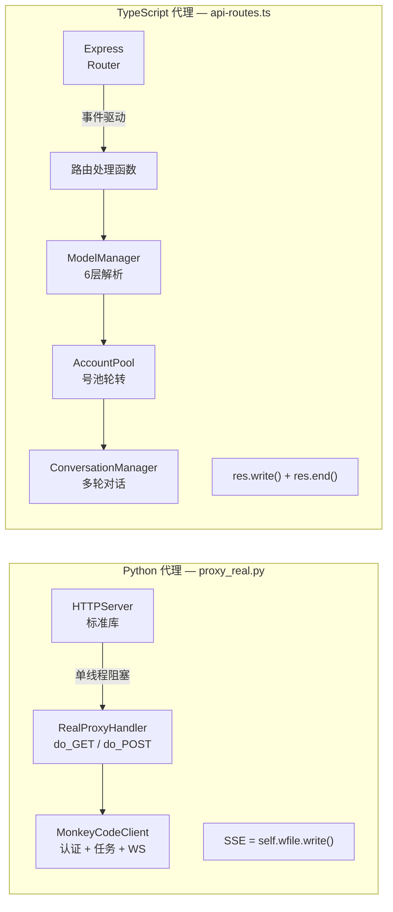
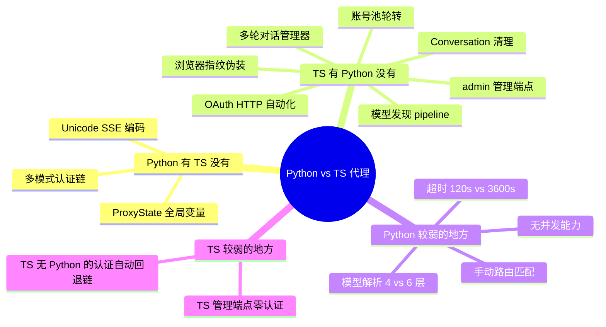
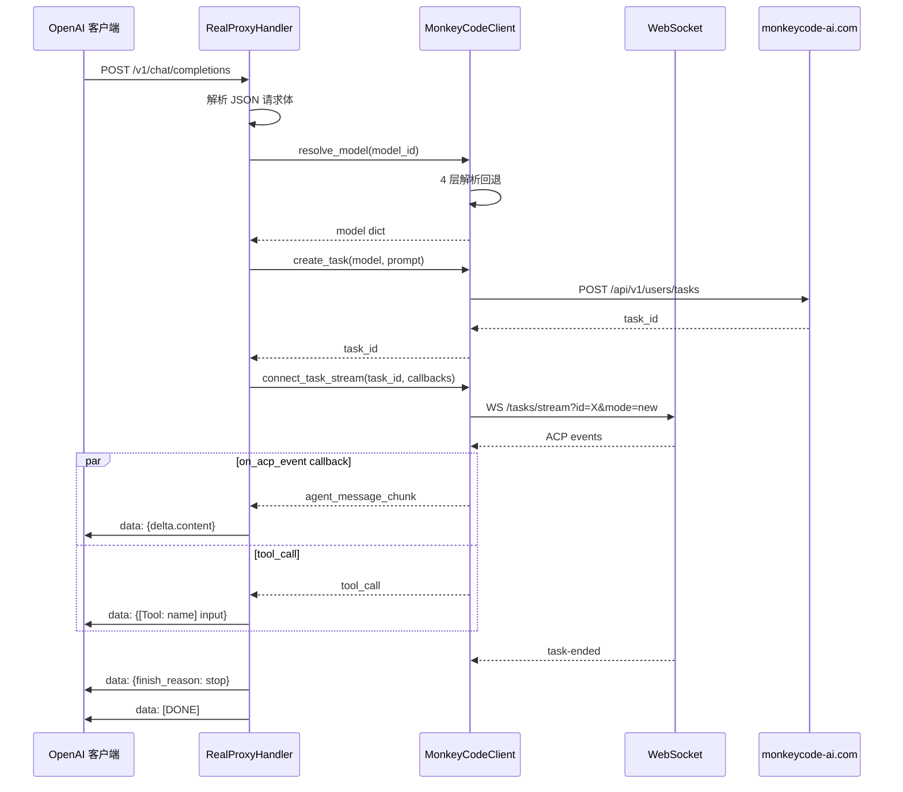

# Python MVP 代理完整实现分析

> **所属分类:** 新维度 #32 — Python MVP proxy_real.py 完整实现
> **关键发现:** Python 代理（874 行）vs TypeScript 代理（545 行）的 7 个关键差异，Python 版缺失 5 个关键功能

## 1. 架构对比



## 2. 关键功能对比表

| 功能 | Python proxy_real.py | TypeScript api-routes.ts | 差距 |
|------|--------------------|-------------------------|------|
| HTTP 服务器 | HTTPServer（标准库） | Express 框架 | 🟡 Python 无框架 |
| 路由处理 | 手工 if-else 匹配 | Router.get/post | 🟡 Python 手动 |
| 请求体解析 | 手工 self.rfile.read() | express.json() 中间件 | 🟡 Python 手动 |
| CORS 支持 | 手工设置头 | cors() 中间件 | 🟡 功能等价 |
| SSE 流式 | self.wfile.write() | res.write() | 🟢 等价 |
| 模型缓存 | 全局变量 5 分钟 TTL | ModelManager 类 5 分钟 TTL | 🟢 等价 |
| 模型解析 | 4 层回退 | 6 层回退 | 🟡 Python 少 2 层 |
| **账号池** | ❌ 无 | ✅ AccountPool 完整实现 | 🔴 严重缺失 |
| **多轮对话** | ❌ 无 | ✅ ConversationManager | 🔴 严重缺失 |
| **OAuth 登录** | ❌ 无 | ✅ admin-login.ts | 🔴 严重缺失 |
| **管理端点** | ❌ health 唯一 | ✅ 12 个管理端点 | 🟡 中 |
| **错误处理** | try/except (2 级) | 结构化错误处理 (5 级) | 🟡 少 |
| **超时控制** | 120s hardcoded | 3600s 可配置 | 🟡 Python 硬编码 |
| 并发能力 | 单线程阻塞 | 事件驱动非阻塞 | 🔴 Python 无法并发 |

## 3. 32 个功能点详细对比



## 4. Python 代理的执行链



## 5. 关键技术差异

### 5.1 模型解析：4 层 vs 6 层

```python
# mvp/client.py:252-322 — 4 层回退
def resolve_model(self, model_id):
    # L1: provider/model 匹配
    # L2: model 名称精确匹配
    # L3: display_name 匹配
    # L4: 默认模型 / 第一个可用

# proxy/src/models.ts:64-90 — 6 层回退
# L1: monkeycode/provider/model 精确
# L2: provider/model
# L3: model 名称
# L4: display_name
# L5: is_default
# L6: models[0] || null
```

### 5.2 流式响应处理

```python
# mvp/proxy_real.py:262-405 — 流式处理
# 使用 threading.Event 做同步
done_event = threading.Event()
done_event.wait(timeout=120)  # 120s 硬编码超时

# TS 代理 — 使用 Promise + AbortController
await new Promise((resolve, reject) => { ... })
// 超时 3600s，可配置
```

### 5.3 Responses API 支持

```python
# mvp/proxy_real.py:477-570 — Responses API
# 包含完整的 response.created → output_item.added → completed 事件
# 与 TS 实现功能等价
```

## 6. 关键发现

| 发现 | 详情 |
|------|------|
| **Python 代理缺失 5 个核心功能** | 无账号池、无多轮对话、无 OAuth 自动化、无管理端点、无浏览器指纹 |
| **Python 代理仅用于协议验证** | 不存在生产用途，仅用于协议理解 |
| **HTTP 服务器选型影响大** | Python HTTPServer 单线程 vs Express 事件驱动 |
| **模型解析少 2 层** | Python 4 层 vs TS 6 层，少 monkeycode/ 前缀匹配 |
| **超时控制硬编码** | Python 120s vs TS 3600s 可配 |
| **SSE 实现等价** | 两个实现的 SSE 格式完全相同 |
| **Responses API 实现一致** | 事件序列和字段完全匹配 |

---

**更新状态:** ✅ 新维度已分析完成
**更新索引:** docs/08-analysis-rounds/unknown-gaps-index.md