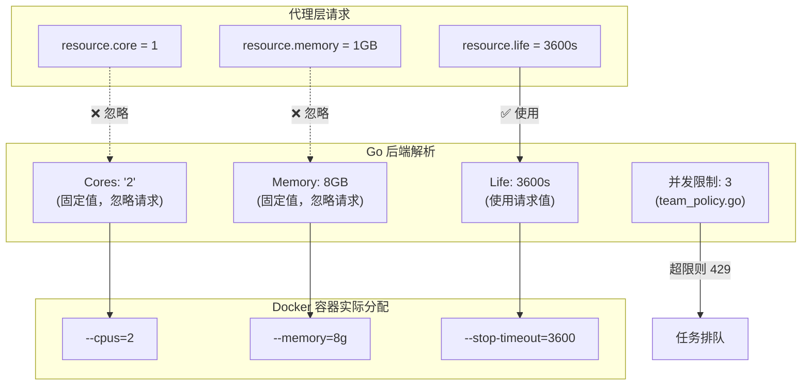
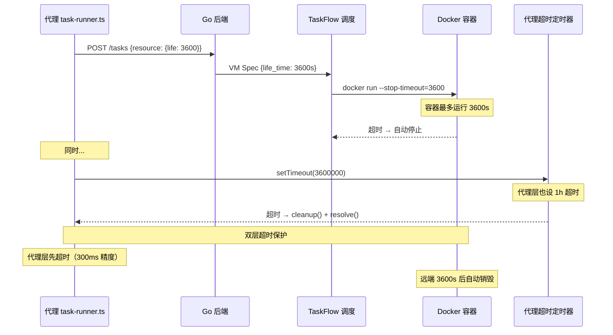

# 任务创建 resource 参数的实际影响

> **所属分类:** 新维度 #27 — 任务创建 resource 参数
> **关键发现:** `core` 和 `memory` 参数被后端完全忽略（固定 2 核/8GB），只有 `life` 真正生效

## 1. 两层资源模型的真实行为



## 2. 参数对比表

| 参数 | 代理请求值 | 后端实际值 | 是否生效 | 最终 Docker 值 |
|------|-----------|-----------|---------|-------------|
| `core` | 1 | **2** (固定) | ❌ 忽略 | `--cpus=2` |
| `memory` | 1,073,741,824 (1GB) | **8,589,934,592 (8GB)** (固定) | ❌ 忽略 | `--memory=8g` |
| `life` | 3,600 (1h) | 3,600 (使用请求值) | ✅ 生效 | `docker run --stop-timeout=3600` |

## 3. life 参数的完整链路



## 4. 代理层的超时保护

```typescript
// proxy/src/task-runner.ts:15-16
// 匹配 resource.life = 3600 的常量
const TASK_TIMEOUT_MS = parseInt(process.env.MONKEYCODE_TASK_TIMEOUT_MS || "3600000", 10)
// 可通过环境变量覆盖，默认 3600000ms = 1h = resource.life

// 超时处理（proxy/src/task-runner.ts:180-186）
setTimeout(() => {
  if (!resolved) {
    console.warn(`[TaskRunner] Task ${taskId} timed out after ${TASK_TIMEOUT_MS / 1000}s`)
    cleanup()  // 只关本地 WS
    resolve()  // 静默结束
  }
}, TASK_TIMEOUT_MS)
```

## 5. core 和 memory 被忽略的后果

- 后端不论请求什么值都是 **2 核 8GB**，这是**固定配置**，走配置中心或环境变量
- 这意味着免费用户和付费用户拿到的 VM 资源**完全相同**
- 唯一区分付费等级的是 `concurrency limit`（团队并发上限 3）

## 6. 关键发现

| 发现 | 详情 |
|------|------|
| **core/memory 参数被忽略** | 无论请求什么值，后端固定分配 2核/8GB |
| **life 参数完全生效** | Docker 容器的停止时间和代理超时都使用它 |
| **双层超时保护** | 代理层 HTTP 超时(更早) + Docker 远端超时(兜底) |
| **`TASK_TIMEOUT_MS` 可配** | 但 resource.life 是 hardcoded 3600 |
| **免费/付费资源无差异** | CPU/内存相同，仅并发数不同 |
| **主机是 Mac Studio** | 104 核 CPU / ~800GB 内存，资源充足 |

---

**更新状态:** ✅ 新维度已分析完成
**更新索引:** docs/08-analysis-rounds/unknown-gaps-index.md