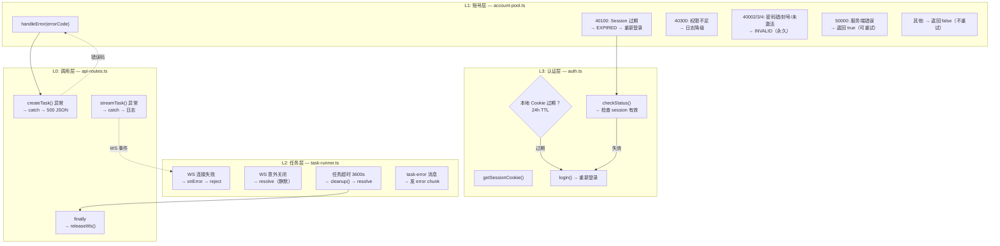
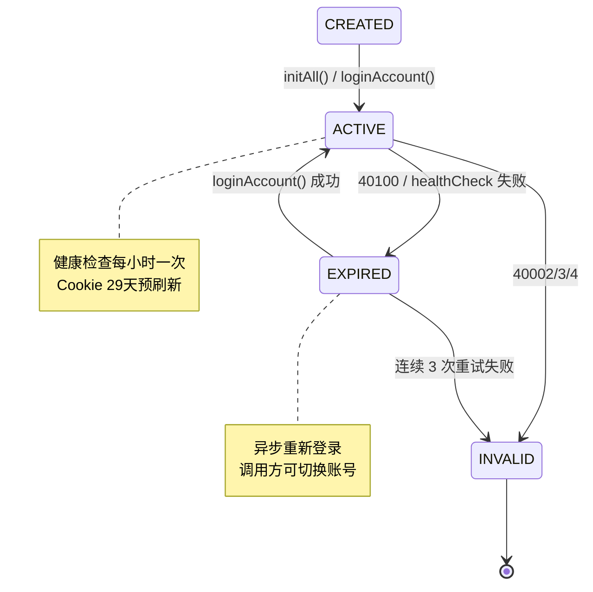
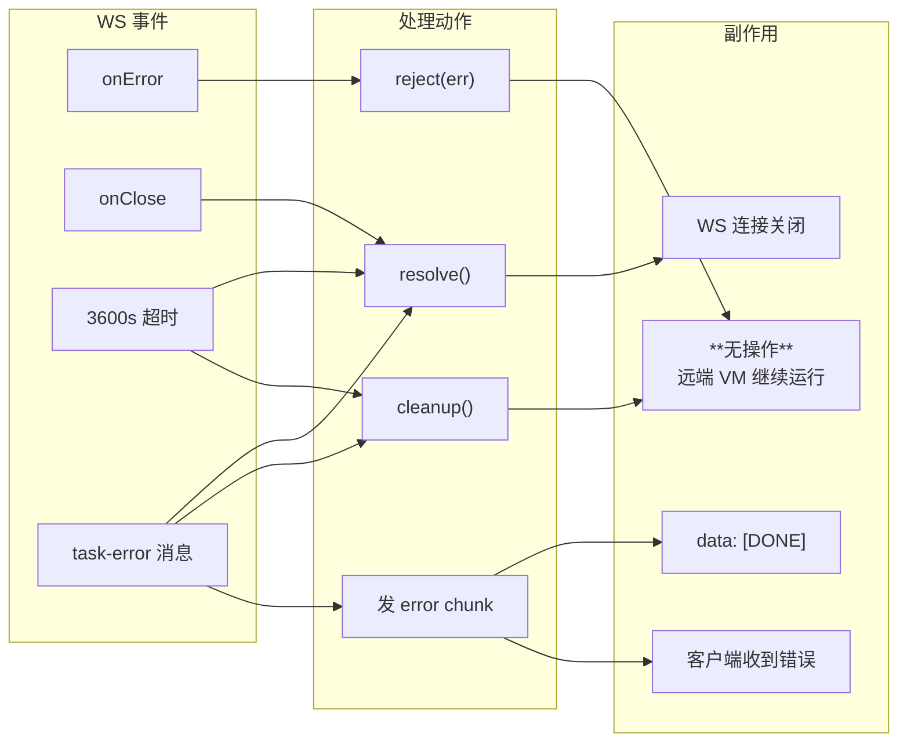
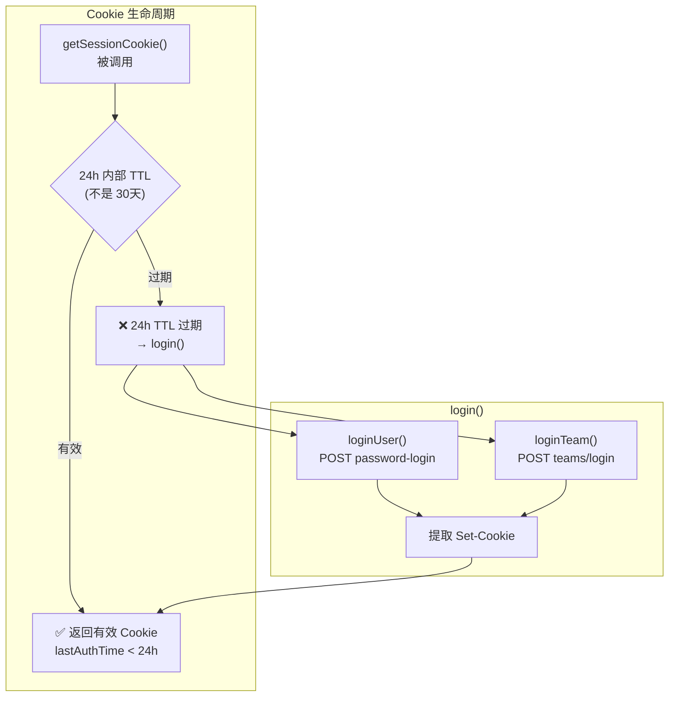
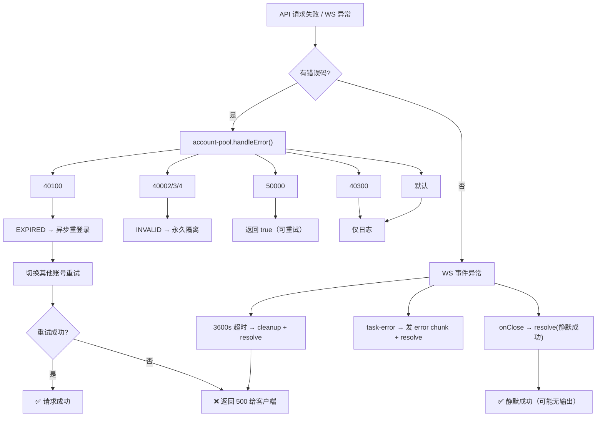

# LLM 调用失败重试策略深度分析

> **所属分类:** P0 缺口 #4 — LLM 调用失败的重试策略
> **关键发现:** 重试策略分为 3 个独立层级——账号层（account-pool.ts）、任务层（task-runner.ts）、认证层（auth.ts）——各层之间没有统一的错误传播链路

## 1. 三层重试架构



## 2. 账号层错误处理 (handleError)

```typescript
// proxy/src/account-pool.ts:214-242
handleError(auth: AuthManager, errorCode: number): boolean {
  switch (errorCode) {
    case 40100: // 会话无效
      entry.status = "EXPIRED"
      this.loginAccount(entry).catch(() => {})  // 异步重新登录
      return true  // 调用方可切换账号重试

    case 40300: // 权限不足
      return false

    case 40002: // 密码错误
    case 40003: // 账号被封
    case 40004: // 账号未激活
      entry.status = "INVALID"  // 永久标记
      return false

    case 50000: // 服务端错误
      return true  // 可重试

    default:
      return false
  }
}
```

### 错误码分类矩阵

| 错误码 | 含义 | 账号状态 | 可重试? | 处理方式 |
|--------|------|---------|--------|---------|
| `40100` | Session 无效 | → EXPIRED | ✅ 是 | 异步重登录 + 调用方切换账号 |
| `40300` | 权限不足 | 保持 ACTIVE | ❌ 否 | 仅日志（正常降级） |
| `40002` | 密码错误 | → INVALID | ❌ 否 | 永久失效 |
| `40003` | 账号被封 | → INVALID | ❌ 否 | 永久失效 |
| `40004` | 账号未激活 | → INVALID | ❌ 否 | 永久失效 |
| `50000` | 服务端错误 | 保持 ACTIVE | ✅ 是 | 调用方可重试（指数退避? 无） |

> ⚠️ **关键缺陷**：50000 虽然返回 true，但调用方并没有实现重试逻辑。意味着"可重试"这个信号实际上没被消费。

## 3. 账号生命周期状态机



## 4. 健康检查 — 主动修复机制

```typescript
// proxy/src/account-pool.ts:155-190
// 每小时执行一次
const HEALTH_CHECK_INTERVAL_MS = 60 * 60 * 1000

// 每次健康检查执行：
for (const entry of this.accounts) {
  // 1. 清理僵尸 WS 锁（超时 3600s+60s 未释放的锁）
  if (entry.lockedByWs && entry.lockedAt && Date.now() - entry.lockedAt > WS_LOCK_MAX_MS) {
    entry.lockedByWs = false  // 强制解锁
  }

  // 2. 检查 Cookie 年龄（29 天硬限制，提前 1 天重刷）
  if (entry.cookieSetAt && Date.now() - entry.cookieSetAt > SESSION_MAX_AGE_MS) {
    await this.loginAccount(entry)  // 重新登录刷新 Cookie
  }

  // 3. 调用 /users/status 检查 session 有效
  const ok = await entry.auth.checkStatus()
  if (!ok) { await this.loginAccount(entry) }
}
```

### 4.1 僵尸 WS 锁检测

```typescript
const WS_LOCK_MAX_MS = TASK_TIMEOUT_MS + 60_000
// = 3600000 + 60000 = 3660000ms ≈ 61 分钟
```

WS 锁的超时时间比任务超时多 1 分钟。如果任务超时后 WebSocket 没有正常关闭释放锁，健康检查会强制释放。

## 5. 任务层的"静默"错误处理



**关键问题:**

| 问题 | 详情 |
|------|------|
| **超时不清除远端 VM** | cleanup() 只关闭本地 WS，不调用 `stopTask()`，远端 VM 继续占用资源 |
| **onClose 静默成功** | WS 连接意外关闭时 resolve() 而不是 reject()，调用方以为任务成功了 |
| **没有指数退避** | 没有 retry-after 逻辑，重试是"立即"的 |
| **task-error 无重试** | 收到 task-error 后直接发 error chunk，不再重试 |

## 6. 认证层的 Session 自动刷新

```typescript
// proxy/src/auth.ts:57-63
async getSessionCookie(): Promise<string> {
  // 检查 Cookie 年龄是否超过 24h TTL
  if (this.sessionCookie && Date.now() - this.lastAuthTime < this.sessionTTL) {
    return this.sessionCookie  // 有效，直接返回
  }
  await this.login()  // 过期，重新登录
  return this.sessionCookie
}
```



> **重要发现:** AuthManager 内部有 **两个 TTL**
> - `sessionTTL` = 24h（代码内部使用，用于触发自动重新登录）
> - 服务器端的 Cookie 实际 TTL = 30 天（不可刷新）
> - 账号池的 `SESSION_MAX_AGE_MS` = 29 天（提前 1 天重刷）

## 7. 告警阈值

```typescript
// proxy/src/account-pool.ts:257-266
if (activeRatio < 0.5) {
  // P0 ALERT: 可用账号 < 50%
} else if (activeRatio < 0.7) {
  // P1 WARN: 可用账号 < 70%
}
```

| 级别 | 阈值 | 动作 |
|------|------|------|
| P0 | 活跃账号 < 50% | 严重告警 |
| P1 | 活跃账号 < 70% | 一般告警 |
| 正常 | 活跃账号 >= 70% | 无告警 |

## 8. 完整错误处理链



## 9. 关键发现

| 发现 | 详情 | 影响 |
|------|------|------|
| **50000 重试信号未消费** | handleError 返回 true 但调用方没有对应重试循环 | 服务端错误不会重试 |
| **超时不会清理远端 VM** | cleanup() 只关本地 WS，不调 stopTask() | VM 继续占资源 |
| **WS onClose 静默成功** | WS 异常关闭时 resolve() 而不是 reject/reconnect | 数据可能不完整但客户端以为成功 |
| **无指数退避** | 所有重试都是"立即"的 | 可能加重服务器压力 |
| **task-error 无重试** | agent 报告错误后直接结束，不会自动重试 | 瞬时错误导致任务失败 |
| **双层 TTL 保护** | 内部 24h + 账号池 29d + 服务端 30d | 三重 Refresh 防线 |
| **僵尸锁清理机制** | 超时 61 分钟后强制释放 WS 锁 | 账号不会永久锁死 |
| **告警阈值为 hardcoded** | 50%/70% 不可配置 | 需要改代码调整 |
| **断言: 无指数退避** | 没有 retry delay、backoff multiplier、jitter 等概念 | 改进方向 |

## 10. 改进建议

1. **消费 50000 重试信号** — 在 api-routes.ts 中实现重试循环（最多 3 次，指数退避 1s/2s/4s）
2. **超时时清理远端 VM** — 在 cleanup() 中增加 `await this.stopTask(taskId)`
3. **WS onClose 区分场景** — 如果未收到 task-ended 且未超时，重新连接而非静默成功
4. **增加指数退避** — 在 loginAccount() 和重试时实现退避策略
5. **告警阈值可配置** — 通过环境变量暴露 P0/P1 阈值

---

**更新状态:** ✅ 已分析完成
**更新文件:** docs/08-analysis-rounds/unknown-gaps-index.md