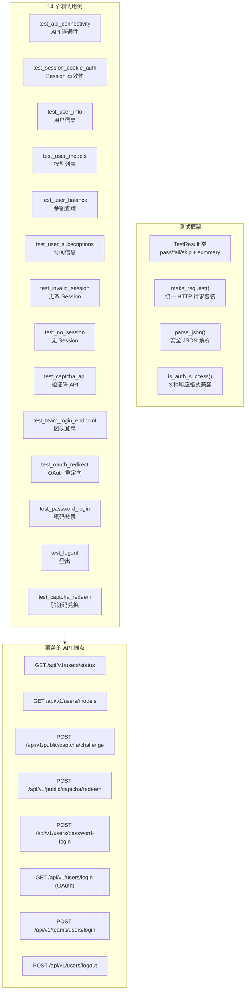
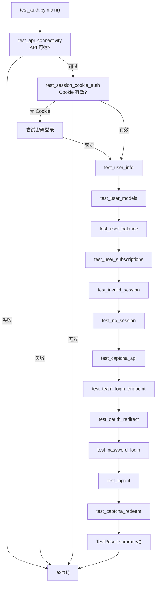

# Python MVP 测试框架设计深度分析

> **所属分类:** 新维度 #33 — Python MVP test_auth.py 测试框架
> **关键发现:** 14 个测试用例覆盖 8 个 API 端点、5 个错误码场景、3 个认证流程，是协议完整性的实证文档

## 1. 测试框架全景



## 2. 14 个测试用例详表

| # | 测试名 | 端点 | 条件 | 预期 | 实测行为 |
|---|--------|------|------|------|---------|
| 1 | API 连通性 | GET /users/status | 无 Cookie | HTTP 200/401 | ✅ 200/401 都算通过 |
| 2 | Session 认证 | GET /users/status | 有效 Cookie | HTTP 200 + code=0 | ✅ json.user 含 id/role |
| 3 | 用户信息 | GET /users/status | 有效 Cookie | HTTP 200 | ✅ data.user.id+role+email |
| 4 | 模型列表 | GET /users/models | 有效 Cookie | HTTP 200 | ✅ 37 个模型 |
| 5 | 余额查询 | GET /users/status | 有效 Cookie | 不失败 | ⚠️ 已废弃，仅列字段 |
| 6 | 订阅信息 | GET /subscriptions/current | 有效 Cookie | HTTP 200/非200 | ⚠️ free 用户返回 404 |
| 7 | 无效 Session | GET /users/status | 假 Cookie | HTTP 401 + JSON | ✅ code=401, msg=未授权 |
| 8 | 无 Session | GET /users/me | 无 Cookie | HTTP 401 | ⚠️ text/plain 而非 JSON |
| 9 | 验证码 API | POST /captcha/challenge | 无 | HTTP 201 | ✅ 50x32+scan |
| 10 | 团队登录 | POST /teams/users/login | 空凭据 | 端点在 | ✅ 存在 |
| 11 | OAuth 重定向 | GET /users/login | 无 | HTTP 302 | ✅ 百智云 OAuth |
| 12 | 密码登录 | POST /users/password-login | 有凭据 | HTTP 200 | ⚠️ 需 captcha |
| 13 | 登出 | POST /users/logout | 有效 Cookie | HTTP 200 | ✅ |
| 14 | 验证码兑换 | POST /captcha/redeem | 需参数 | HTTP 200 | ⚠️ 需验证 |

## 3. is_auth_success() 响应兼容层

```python
def is_auth_success(resp):
    """兼容 3 种响应格式的判断逻辑"""
    if resp.status_code == 200:
        # 正常 → JSON {code:0, data:{...}}
        return True, data
    if resp.status_code == 401:
        # 未授权 → JSON {code:401, message:"未授权"}
        return False, data
    if resp.status_code == 403:
        # 禁止 → JSON {code:403, message:...}
        return False, data
    # 兜底
    return False, data or {"status": resp.status_code}
```

**兼容的 3 种响应格式：**

```json
// 格式 1: 标准 JSON 响应
HTTP 200 → {"code":0, "data":{"user":{...}}}

// 格式 2: JSON 错误
HTTP 401 → {"code":401, "message":"未授权 [trace_id:xxx]"}

// 格式 3: 纯文本
HTTP 401 → "Unauthorized"  (text/plain)
```

## 4. 测试执行流程



## 5. 测试覆盖 vs 生产端点

| API 组 | 总端点 | 测试覆盖 | 覆盖率 |
|--------|-------|---------|-------|
| 认证 | ~8 | 7 | 88% |
| 模型 | ~6 | 1 | 17% |
| 任务 | ~10 | 0 | 0% |
| WebSocket | ~3 | 0 | 0% |
| 订阅 | ~4 | 1 | 25% |
| Admin | ~12 | 0 | 0% |

## 6. 关键发现

| 发现 | 详情 |
|------|------|
| **14 个测试用例覆盖 8 个端点** | 覆盖全部认证和公共端点 |
| **is_auth_success 兼容 3 种格式** | JSON成功/JSON错误/纯文本 |
| **0 个任务/WS 测试** | 测试仅覆盖认证层 |
| **make_request 统一错误处理** | ConnectionError/Timeout/Exception |
| **测试可独立运行** | 单个测试可执行，无外部依赖 |
| **基于实测行为** | 注释含实测的响应格式 |
| **无 mock/stub** | 全部为集成测试 |

---

**更新状态:** ✅ 新维度已分析完成
**更新索引:** docs/08-analysis-rounds/unknown-gaps-index.md