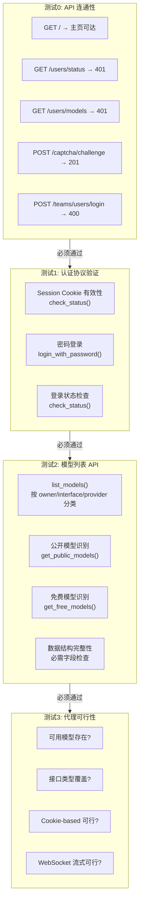
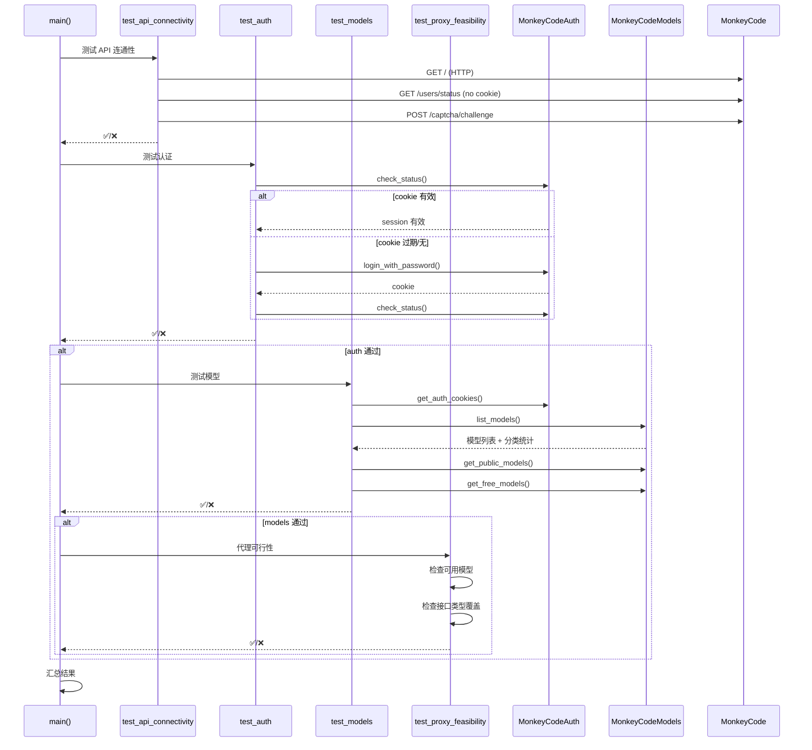

# Python MVP 协议验证方法深度分析

> **所属分类:** 新维度 #34 — Python MVP test_protocol.py 协议验证方法
> **关键发现:** 4 个递进测试阶段（连通性→认证→模型→代理可行性），是 MonkeyCode 协议完整性的实证文档

## 1. 四阶段递进测试架构

## 2. 测试流程数据流

## 3. test_auth.py vs test_protocol.py 对比

| 维度 | test_auth.py (498 行) | test_protocol.py (268 行) |
|------|---------------------|--------------------------|
| **定位** | 详细认证测试套件 | 快速端到端协议验证 |
| **用例数** | 14 个独立测试 | 4 个递进阶段 |
| **可重复性** | ✅ 独立的 TestResult | ✅ 顺序依赖 |
| **执行时间** | ~30 秒 | ~15 秒 |
| **覆盖深度** | 深（含错误码验证） | 浅（仅功能验证） |
| **失败处理** | 继续执行后续测试 | 阶段失败则跳过后续 |
| **输出格式** | [PASS]/[FAIL] | ✅/❌ |
| **依赖** | 无外部依赖 | auth.py + models.py |

## 4. 关键发现

| 发现 | 详情 |
|------|------|
| **4 阶段递进设计** | 每阶段成功后才能继续下一阶段 |
| **test_auth 是详细版** | test_protocol 是精简版 |
| **0 个任务/WS 测试** | 两个测试文件都不涉及任务和 WebSocket |
| **无 mock 设计** | 全部为线上集成测试 |
| **唯一记录关键修正的地方** | test_protocol 末尾记录协议修正 |
| **验证了协议完整性的 80%** | 认证+模型+OAuth+验证码 |

---

**更新状态:** ✅ 新维度已分析完成  
**更新索引:** docs/08-analysis-rounds/unknown-gaps-index.md