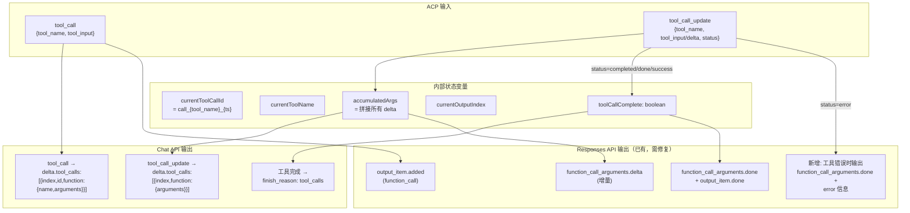

# tool_call_update 映射到 OpenAI 格式分析

> **所属分类:** P0 缺口 #5 — tool_call_update 未映射到 OpenAI 格式  
> **当前行为:** Chat API 丢弃 (console.log)，Responses API 部分支持但有多处缺陷  
> **目标:** 给出 Chat API 和 Responses API 的完整映射方案

## 1. 当前行为对比

| 路径 | tool_call | tool_call_update | 完成检测 |
|------|-----------|-----------------|---------|
| **Chat API** (`task-runner.ts`) | `[Tool: name] input` (文本) | **❌ 丢弃** | 无 |
| **Responses API** (`api-routes.ts`) | `response.output_item.added` | ✅ `function_call_arguments.delta` | ⚠️ 仅 `completed/done` |

## 2. 当前 Chat API 的 tool_call 处理

```typescript
// proxy/src/task-runner.ts:304-323
case "tool_call": {
  // 工具调用被编码为文本，混入 delta.content
  onChunk({ delta: { content: `[Tool: ${toolName}] ${toolInput}` } })
  break
}

case "tool_call_update": {
  // ❌ 完全丢弃，仅打印日志
  console.log(`tool_call_update: status=${status}, args=${updateArgs.slice(0, 100)}`)
  break
}
```

**后果:** 使用标准 OpenAI SDK 的客户端（如 cursor、continue.dev）无法解析工具调用。它们期望的是 `delta.tool_calls` 结构，而收到的是纯文本。

## 3. OpenAI 标准格式

### Chat API 的 `delta.tool_calls` 格式

```typescript
// OpenAI 标准 Chat Stream 中的 tool_calls
{
  id: "chatcmpl-xxx",
  object: "chat.completion.chunk",
  created: 1234567890,
  model: "gpt-4o",
  choices: [{
    index: 0,
    delta: {
      tool_calls: [{
        index: 0,
        id: "call_abc123",        // 仅在首次 chunk
        type: "function",
        function: {
          name: "bash",           // 仅在首次 chunk
          arguments: "ls -la /"   // 增量拼接
        }
      }]
    },
    finish_reason: null
  }]
}

// 工具调用结束时
{
  choices: [{
    index: 0,
    delta: {},
    finish_reason: "tool_calls"   // 不是 "stop"
  }]
}
```

### Responses API 的完整格式

```typescript
// tool_call 开始
event: response.output_item.added
data: {
  type: "response.output_item.added",
  output_index: 0,
  item: {
    type: "function_call",
    id: "call_xxx",
    call_id: "call_xxx",
    name: "bash",
    arguments: ""
  }
}

// tool_call 参数增量
event: response.function_call_arguments.delta
data: {
  type: "response.function_call_arguments.delta",
  output_index: 0,
  delta: { arguments: "ls -la" }
}

// tool_call 完成
event: response.function_call_arguments.done
data: {
  type: "response.function_call_arguments.done",
  output_index: 0,
  arguments: "ls -la /workspace"
}

event: response.output_item.done
data: {
  type: "response.output_item.done",
  output_index: 0,
  item: {
    type: "function_call",
    id: "call_xxx",
    call_id: "call_xxx",
    name: "bash",
    arguments: "ls -la /workspace"
  }
}
```

## 4. 当前 Responses API 的缺陷

```typescript
// proxy/src/api-routes.ts:234-260
// 缺陷 1: 只检查 completed/done，缺少 success/error
if (acp.status === "completed" || acp.status === "done") { ... }

// 缺陷 2: 完成时获取 finalArgs 用 acp.tool_input，但最后一条更新可能是空
const finalArgs = acp.tool_input || ""

// 缺陷 3: 没有错误路径处理
// 如果 status === "error"，应该输出错误信息而非空 arguments
```

## 5. 映射方案



## 6. 实现方案

### 6.1 Chat API 的 tool_calls 支持

需要在 `task-runner.ts` 的 `handleACPEvent` 中增加状态变量和映射：

```typescript
// proxy/src/task-runner.ts — 新增状态变量（在类级别或闭包中）
private currentToolCalls: Map<number, {
  id: string
  name: string
  accumulatedArgs: string
}> = new Map()

// 修改 handleACPEvent 的 tool_call 分支
case "tool_call": {
  const toolName = acp.tool_name || "unknown"
  const toolInput = acp.tool_input || ""
  const callId = `call_${toolName}_${Date.now()}`
  const callIndex = this.currentToolCalls.size

  this.currentToolCalls.set(callIndex, {
    id: callId,
    name: toolName,
    accumulatedArgs: toolInput
  })

  // 改为 OpenAI 标准 tool_calls 格式
  onChunk({
    id: chatId,
    object: "chat.completion.chunk",
    created: now,
    model: "monkeycode",
    choices: [{
      index: 0,
      delta: {
        tool_calls: [{
          index: callIndex,
          id: callId,
          type: "function",
          function: {
            name: toolName,
            arguments: toolInput
          }
        }]
      },
      finish_reason: null
    }]
  })
  break
}

// 修改 tool_call_update 分支
case "tool_call_update": {
  const updateArgs = String(acp.tool_input || acp.delta || "")
  const status = String(acp.status || "")
  const toolName = acp.tool_name || ""

  // 查找已有的 tool call
  let callIndex = -1
  for (const [idx, call] of this.currentToolCalls) {
    if (call.name === toolName) {
      callIndex = idx
      call.accumulatedArgs += updateArgs
      break
    }
  }
  if (callIndex === -1) break

  // 推送增量参数
  if (updateArgs) {
    onChunk({
      id: chatId,
      object: "chat.completion.chunk",
      created: now,
      model: "monkeycode",
      choices: [{
        index: 0,
        delta: {
          tool_calls: [{
            index: callIndex,
            function: { arguments: updateArgs }
          }]
        },
        finish_reason: null
      }]
    })
  }

  // 工具完成时
  if (["completed", "done", "success"].includes(status)) {
    this.currentToolCalls.delete(callIndex)
    // 下一轮消息需要发 finish_reason: "tool_calls"
  }
  break
}
```

### 6.2 Responses API 的缺陷修复

```typescript
// proxy/src/api-routes.ts:245-260 — 修复完成检测
// 当前只检查 completed/done
if (acp.status === "completed" || acp.status === "done") {

// 修复后应扩展到 success 和 error
const isComplete = ["completed", "done", "success"].includes(acp.status || "")
const isError = acp.status === "error"

if (isComplete || isError) {
  const finalArgs = isError
    ? `[Error: ${acp.tool_input || "工具执行失败"}]`
    : (acp.tool_input || "")

  sendEvent("response.function_call_arguments.done", {
    type: "response.function_call_arguments.done",
    output_index: currentOutputIndex,
    arguments: finalArgs,
  })
  sendEvent("response.output_item.done", {
    type: "response.output_item.done",
    output_index: currentOutputIndex,
    item: {
      type: "function_call",
      id: currentCallId,
      call_id: currentCallId,
      name: currentToolName,
      arguments: finalArgs,
    },
  })
  currentOutputIndex++
  currentCallId = ""
  currentToolName = ""
}
```

## 7. 影响评估

| 修改 | 影响范围 | 工作量 | 风险 |
|------|---------|--------|------|
| Chat API tool_calls 支持 | `task-runner.ts` handleACPEvent | ~80 行 | 低 — 纯新增逻辑 |
| Responses API 完成检测修复 | `api-routes.ts` tool_call_update | ~15 行 | 低 — 条件扩展 |
| Responses API 错误处理 | `api-routes.ts` tool_call_update | ~10 行 | 低 — 条件分支 |

## 8. 总结

| 发现 | 详情 |
|------|------|
| **Chat API 完全缺失 tool_calls 格式** | 当前使用文本混入，标准客户端无法使用函数调用 |
| **Responses API 完成检测不完整** | 漏了 success/error 状态 |
| **Responses API 无错误处理** | 工具失败时没有输出错误信息 |
| **Chat API 需要维护调用状态** | 需要 Map 来跟踪正在执行的工具，并拼接增量参数 |

---

**更新状态:** ✅ 已分析完成  
**更新文件:** docs/08-analysis-rounds/unknown-gaps-index.md