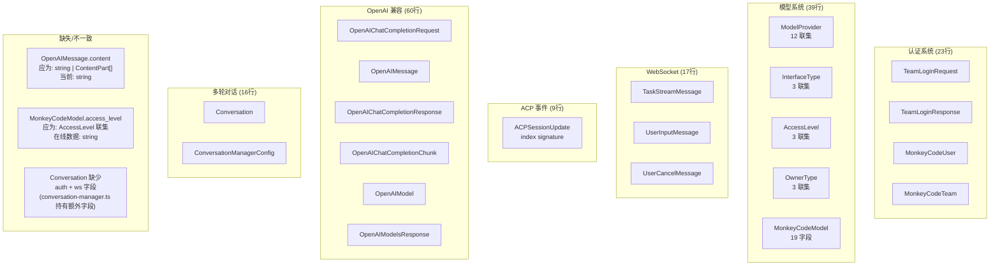

# types.ts 类型系统设计演进

> **所属分类:** 新维度 #30 — types.ts 类型系统的设计演进
> **关键发现:** 类型系统按功能模块划分为 5 个独立区域，有 2 个类型定义不一致和 1 个缺失类型

## 1. 类型系统全景



## 2. 每区域的行数和密度

| 区域 | 行数 | 接口数 | 行数占比 | 密度(行/接口) |
|------|------|--------|---------|-------------|
| 认证 | 23 | 4 | 13% | 5.8 |
| 模型 | 39 | 5 | 22% | 7.8 |
| WebSocket | 17 | 3 | 9% | 5.7 |
| ACP | 9 | 1 | 5% | 9.0 |
| OpenAI 兼容 | 60 | 6 | 33% | 10.0 |
| 多轮对话 | 16 | 2 | 9% | 8.0 |

## 3. 设计演进分析

### 3.1 `ACPSessionUpdate` 的 index signature

```typescript
export interface ACPSessionUpdate {
  type: string
  text?: string
  content?: string
  input_tokens?: number
  output_tokens?: number
  total_tokens?: number
  [key: string]: unknown  // 动态扩展点
}
```

**设计意图:** ACP 事件有 7 种类型，每种携带不同字段（`tool_name`、`tool_input`、`delta`、`status`、`steps`、`commands`）。用 index signature 让单一类型承载所有变体，运行时通过 `type` 字段分发。

**这是 Go 的 `interface{}` + type switch 在 TypeScript 中的等价表达。**

### 3.2 `ModelProvider` 的 12 联集

```typescript
export type ModelProvider =
  | "siliconflow" | "openai" | "ollama" | "deepseek"
  | "moonshot" | "azure_openai" | "baizhicloud" | "hunyuan"
  | "bailian" | "volcengine" | "gemini" | "other"
```

**设计意图:** 在类型安全和服务发现之间取得平衡——11 个已知提供商编译时检查，同时 `"other"` 兜底未来新增。

### 3.3 `OpenAIChatCompletionRequest` 的扩展字段

```typescript
export interface OpenAIChatCompletionRequest {
  model: string
  messages: OpenAIMessage[]
  temperature?: number
  max_tokens?: number
  stream?: boolean
  conversation_id?: string  // 非标准扩展
}
```

`conversation_id` 是 MonkeyCode 对 OpenAI 标准协议的扩展，用于多轮对话复用。这是类型系统的"扩展点"模式——在标准基础上加非标准字段。

## 4. 3 个不一致问题

### 问题 1: `OpenAIMessage.content` 类型过于简单

```typescript
// proxy/src/types.ts:114-117
export interface OpenAIMessage {
  role: "system" | "user" | "assistant"
  content: string  // ❌ 应该支持多模态数组格式
}

// OpenAI 标准 — ChatGPT 消息支持多模态
interface OpenAIMessage {
  role: "system" | "user" | "assistant" | "tool"
  content: string | ContentPart[]  // ✅ 多模态
  tool_calls?: ToolCall[]          // ✅ 工具调用
  tool_call_id?: string            // ✅ 工具结果
}
```

**影响:** 当前类型不支持 tool call 的 `tool_calls` 字段和 tool 响应。当转发 OpenAI 客户端的工具调用时，类型检查会报错。

### 问题 2: `MonkeyCodeModel` 字段与实际 API 响应不一致

```typescript
// proxy/src/types.ts:52-70
access_level: AccessLevel  // AccessLevel = "basic" | "pro" | "ultra"

// 实际线上响应:
"access_level": ""  // 空字符串！
"is_hidden": false  // 存在于 API 响应但不在类型中
"remark": ""        // 存在于 API 响应但不在类型中
```

**影响:** 线上 API 返回的 `access_level` 可能是空字符串，但类型中说它是 `AccessLevel` 联集。`is_hidden` 和 `remark` 字段完全缺失。

### 问题 3: `Conversation` 类型与 conversation-manager.ts 的实现不一致

```typescript
// proxy/src/types.ts:167-174 — 导出的 Conversation 接口
export interface Conversation {
  id: string
  taskId: string
  modelId: string
  messages: OpenAIMessage[]
  lastUsedAt: number
  createdAt: number
  // ❌ 缺少以下字段
}

// proxy/src/conversation-manager.ts:26-38 — 实际使用的 Conversation 类型
export interface Conversation {
  model: MonkeyCodeModel  // 而非 modelId: string
  auth: AuthManager       // ❌ 完全缺失
  ws: WebSocket | null    // ❌ 完全缺失
  onChunk: ((chunk) => void) | null
  resolvePromise: (() => void) | null
  rejectPromise: ((err: Error) => void) | null
  // ... 还有其他字段
}
```

**影响:** types.ts 导出的 Conversation 是**缩水版**，完整版只在 conversation-manager.ts 中有定义。如果其他模块引用 types.ts 的 Conversation，会缺少关键字段。

## 5. 类型缺失清单

| 缺失类型 | 应该在哪 | 说明 |
|---------|---------|------|
| `ToolCall` | OpenAI 区域 | OpenAI 的 `tool_calls` Delta 格式 |
| `ContentPart` | OpenAI 区域 | 多模态消息的 Content Part 定义 |
| `ACPError` | ACP 区域 | ACP 事件的错误类型（含 error_code + trace_id） |
| `TaskCreationResponse` | — | 任务创建 API 的响应格式 |
| `PoolConfig` | — | 账号池的完整配置类型 |

## 6. 关键发现

| 发现 | 详情 |
|------|------|
| **5 个逻辑区域清晰** | 认证/模型/WS/ACP/OpenAI，模块化设计 |
| **ACP index signature 是 Go 风格** | TypeScript 中极少见这种模式 |
| **OpenAIMessage 不支持 tool_calls** | 标准 OpenAI 协议的 tool calling 无法表达 |
| **MonkeyCodeModel 缺少 2 个字段** | `is_hidden`、`remark` |
| **Conversation 类型有两个版本** | types.ts 是缩水版，conversation-manager.ts 是完整版 |
| **access_level 可能为空字符串** | 类型定义未覆盖实际数据 |
| **TypeScript proxy 的弱类型倾向** | 多处用 `any`、`Record<string, unknown>` 绕过类型检查 |

---

**更新状态:** ✅ 新维度已分析完成
**更新索引:** docs/08-analysis-rounds/unknown-gaps-index.md