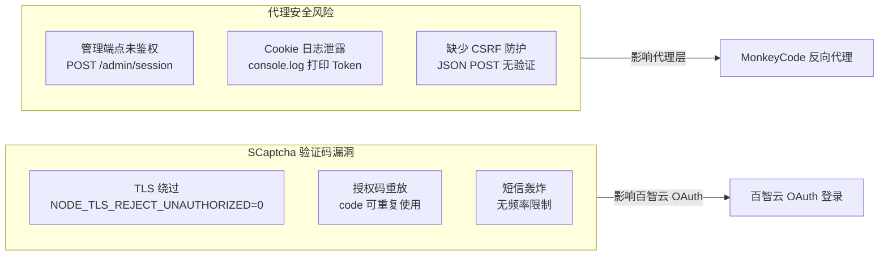

# 第九章：安全分析

> **章节状态:** ✅ 基础内容已迁移
> **最后更新:** 2026-06-25
> **覆盖范围:** MonkeyCode 以及关联平台的安全测试报告

---

## 文件清单

| # | 文件 | 内容 | 完成度 |
|---|------|------|--------|
| 1 | [baizhi-security-report.md](baizhi-security-report.md) | 百智云安全测试报告（SCaptcha 漏洞发现、安全评估） | ✅ 已完成 |
| 2 | **[02-proxy-security-analysis.md](02-proxy-security-analysis.md)** | **新增** 代理层安全加固分析（认证安全/会话管理/OWASP Top 10 自评） | ✅ **新维度** |

---

## 安全漏洞发现

所有安全分析均在本仓库的安全框架内进行，仅供教育和防御性安全研究使用。详见项目根目录的 [安全说明](../README.md#-安全说明)。

---

## 相关章节

- [第二章：认证协议](../02-auth/README.md) — 认证协议中的安全边界