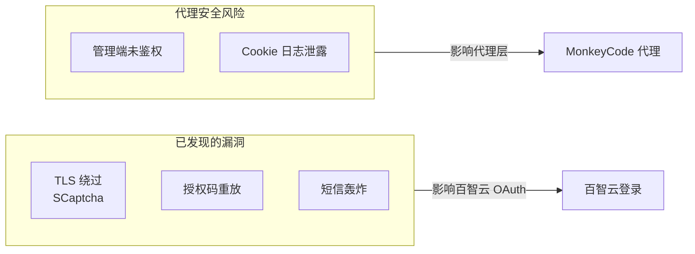

# 安全分析

> **所属位置:** 第五篇·研究记录 — 安全漏洞与加固分析
> **阅读目标:** 了解已发现的安全问题和加固策略

| # | 文件 | 内容 | 行数 |
|---|------|------|------|
| 1 | [百智云安全报告](baizhi-security-report.md) | SCaptcha 漏洞（TLS 绕过/授权码重放/短信轰炸） | 268L |
| 2 | [代理安全加固](02-proxy-security-analysis.md) | OWASP Top 10 自评、管理端点认证、CSRF | 354L |