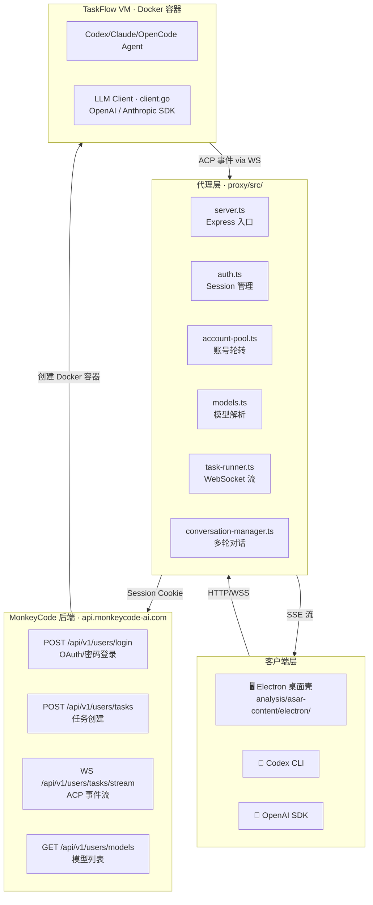
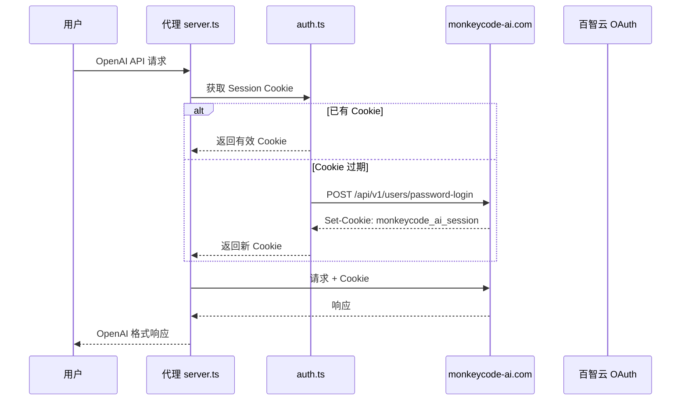

# MonkeyCode 逆向工程分析全书

> **项目:** MonkeyCode Reverse Engineer
> **版本:** 2.3
> **最后更新:** 2026-07-03
> **总文档数:** 119+ 份
> **分析维度:** 40+ 维度全覆盖

---

本项目是对 [MonkeyCode AI](https://monkeycode-ai.com) 平台的全面逆向工程文档，覆盖认证协议、LLM 通信、WebSocket 流式协议、API 端点、VM 生命周期、代理实现等 10 个维度、40+ 分析维度。

## 系统架构全景图

## 认证流程全景图

## 快速导航

| 章节 | 内容 | 文件数 |
|------|------|--------|
| [📐 第一章：系统架构](01-architecture/README.md) | 四层架构、数据流、组件层级、错误处理 | 4 |
| [🔐 第二章：认证协议](02-auth/README.md) | Session 存储、验证码、5 种登录方式 | 8 |
| [🤖 第三章：LLM 通信协议](03-llm/README.md) | 3 种接口类型、11 个提供商、模型定价 | 7 |
| [🔌 第四章：WebSocket 协议](04-websocket/README.md) | Stream/Control/Terminal/ACP 事件 | 7 |
| [🌐 第五章：API 端点和授权](05-api/README.md) | 100+ 端点、授权矩阵、订阅计费 | 5 |
| [🖥️ 第六章：VM & TaskFlow](06-vm-taskflow/README.md) | TaskFlow 架构、VM 生命周期、MCP | 5 |
| [⚡ 第七章：代理实现](07-proxy/README.md) | 号池、多轮对话、ACP 映射、OAuth | 11 |
| [📊 第八章：分析轮次](08-analysis-rounds/README.md) | 18 轮逆向分析全记录 | 3 |
| [🛡️ 第九章：安全分析](09-security/README.md) | SCaptcha 漏洞、代理安全加固 | 2 |
| [📎 第十章：附录](10-appendices/README.md) | 错误码、环境变量、术语表、代码展品 | 9 |

## 阅读指南

| 兴趣方向 | 推荐路线 |
|---------|---------|
| 🧑‍💻 想使用代理 | 第 1 章 → 第 7 章 |
| 🔬 安全研究 | 第 2 章 → 第 9 章 |
| 📐 协议开发 | 第 5 章 → 按需深入各章节 |

---

  Built with ❤️ for research and educational purposes.
   
  作者: <a href="https://github.com/CC11001100">CC11001100</a>
   
  
    Powered by <a href="https://squidfunk.github.io/mkdocs-material/">MkDocs Material</a>
  

